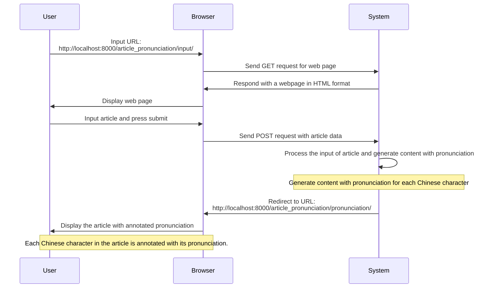
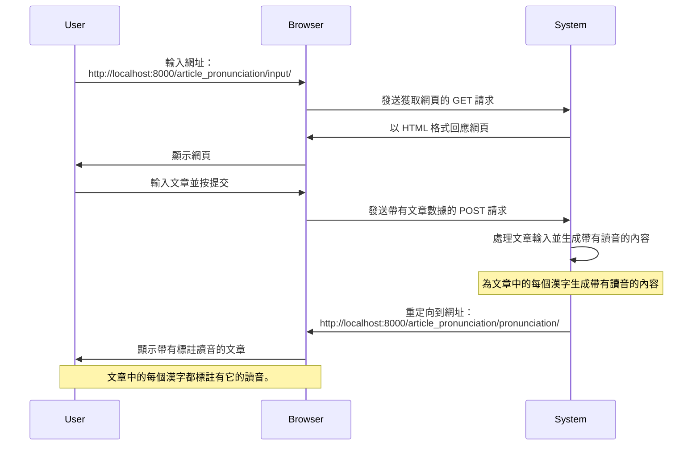

## ChatGPT 諮詢問答錄

```sh
請將這個會談（Session）的「問答」輸出到一個文字檔案。文檔格式需為 markdown 標準。
```

# 問題 1

**用戶**：我需要打造一個應用系統，讓我記錄漢字的「讀音」。我的需求條列如下，請代為撰寫程式碼：
[需求列表]

**AI**：回答了用戶的問題，提供了專案設置和應用程序的實現。

## 問題 2

**用戶**：在執行「系統整合測試（System Integration Test）」及
「系統功能測試（System Functional Test）」 前，我想先做「單元測試（Unit Test）」，請提供可在
Django Project 執行 「單元測試（Unit Test）」的 Python 程式碼。

**AI**：回答了用戶的問題，提供了單元測試的程式碼範例。

## 問題 3

**用戶**：- System Functional Test: 使用 Seleiumn 及 Google Chrome 瀏覽模擬器

**AI**：回答了用戶的問題，提供了如何在系統功能測試中使用 Selenium 和 Google Chrome 的方法。

## 問題 4

**用戶**：以上程式碼改寫成「可於 Python JupyterBook 執行」之程式碼。

**AI**：回答了用戶的問題，提供了在 Jupyter Notebook 中運行功能測試的方法。

## Q5

請提供「安裝及設定的程序步驟」，說明如何建置一個「軟體功能測試環境」。

需求如下：

- Python 程式碼編輯器：使用 Python JupyterBook
- 功能測試工具：
  - 測試軟體：Selenium
  - WebDrive: ChromeDriver
  - 瀏覽器：Chrome
- Python 工具：
  - Python 版本管理工具：pyenv
  - Python Packages 安裝管理工具：poetry
- 輸出：Markdown 文字檔格式

## Q6

請彙總以上所有的問答（只要答覆即可），以 Markdown 文檔格式輸出。

## Files/Directories structure of Django Project

```sh
❯ tree . -L 2
.
├── README.md
├── _archived
│   └── db.sqlite3
├── article_pronunciation
│   ├── __init__.py
│   ├── __pycache__
│   ├── admin.py
│   ├── apps.py
│   ├── migrations
│   ├── models.py
│   ├── templates
│   ├── tests.py
│   ├── urls.py
│   └── views.py
├── db.sqlite3
├── docs
│   ├── ChatGPT_Consult.md
│   ├── Markdownlint_Std.md
│   ├── OP.md
│   ├── SDD.md
│   ├── SRS.md
│   ├── STS-01_功能測試環境建置作業指引.md
│   ├── STS.md
│   └── URS.md
├── han_ji_dict
│   ├── __init__.py
│   ├── __pycache__
│   ├── add_data_to_hanji_dict.py
│   ├── admin.py
│   ├── apps.py
│   ├── migrations
│   ├── models.py
│   ├── tests.py
│   └── views.py
├── manage.py
├── poetry.lock
├── pyproject.toml
├── setup.cfg
├── tests
│   ├── __init__.py
│   ├── __pycache__
│   ├── fn
│   ├── it
│   └── st
├── tools
│   ├── han_ji.csv
│   ├── import_csv.py
│   ├── import_csv_drop_old_table.py
│   ├── import_csv_to_han_ji_dict.py
│   └── setenv.py
└── web_app
    ├── __init__.py
    ├── __pycache__
    ├── asgi.py
    ├── settings.py
    ├── urls.py
    └── wsgi.py

```






## Q11

請改寫 han_ji_dict application，需求如下：

這個 Application 的用途：提供前端的 UI ，供使用者可自行編輯漢字字典。

han_ji_dict.views:

```python
class HanJi(models.Model):
    # 漢字
    han_ji = models.CharField(max_length=2, default='')
    # 漢字讀音編碼
    chu_im = models.CharField(max_length=10, default='')
    # 讀音常用頻率
    freq = models.FloatField(default=0.0)
    # 聲母碼
    siann = models.CharField(max_length=2, default='')
    # 韻母碼
    un = models.CharField(max_length=5, default='')
    # 調號
    tiau = models.IntegerField(default=0)
    # 原編者使用的 BP 標音
    old_chu_im = models.CharField(max_length=10, null=True)
    # 十五音聲母
    sni_siann = models.CharField(max_length=10, default='')
    # 十五音韻母
    sni_un = models.CharField(max_length=10, default='')

    def __str__(self):
        return self.han_ji
```

han_ji_dict application，需求規格：

1. 進入 han_ji_dict 的 Home View 時，請以 HTML TABLE 顯示 20 個漢字字典資料
   ，並提供「上一頁」、「下一頁」的按鈕；
2. Home View 請用 Django View 的 ListView 來實作；
3. 每個漢字均有 Hyper-link ，點擊後將進 Detail View 顯示該漢字的詳細資料；
4. Detail View 中需要按鈕，可回到 han_ji_dict Home View；
5. 仿 CRUD 觀點，提供：加漢字資料（C）、改漢字資料（U）、刪漢字資料（D）。
   所有功能均以 Django View Class 完成。在 Application 的 Home View 均有按鈕；
6. 提供查詢（Query）功能，以便使用者可快速查找某一漢字的讀音資料；
7. 提供篩選功能，以便使用者可依讀音的音標，查找相同發音的漢字。

```htmldjango
<main>
  <div class="container">

  <h1>漢字字典編輯</h1>
  <table>
      <thead>
          <tr>
              <th>漢字</th>
              <th>讀音編碼</th>
              <!-- 添加其他列标题，如所需 -->
          </tr>
      </thead>
      <tbody>

      </tbody>
  </table>

  </div>
</main>
```
