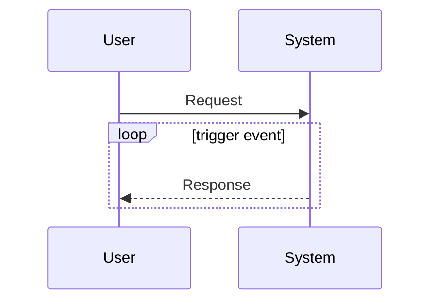
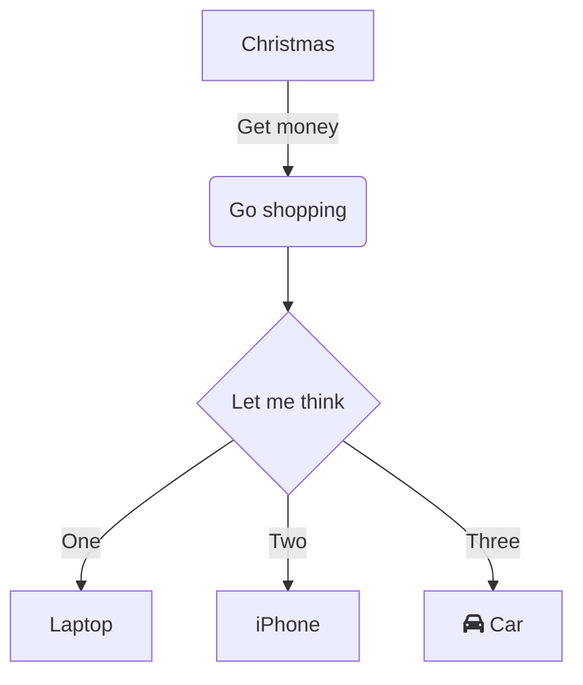

<!-- markdownlint-disable MD024 MD041 MD043 MD033 -->

<!--  -->

<!--  -->
<!-- 
 -->
<!--    -->
<!-- 
 -->

# 《專案指引》

## 簡介

## 專案摘要

我需要打造一個應用系統，讓我記錄漢字的「讀音」。我的需求條列
如下，請代為撰寫程式碼：

- 漢字字庫編輯應用
- 文章標示讀音應用

## 漢字字庫編輯應用

需要一個「漢字字典」管理功能 。使用 han_ji_dict 為 App Name
。功能需求如下

2.1 提供基本編輯功能：新增、更改、刪除及查詢。

2.2 每個漢字標示讀音的方法，各有 5 種：

2.2.1 十五音標音：sip_ngoo_im

2.2.2 方音符號注音：hong_im

2.2.3 教會羅馬字拼音：POJ

2.2.4 台灣閩南語羅馬拼音：TL

2.2.5 中國廈門大學閩拼標音：BP

2.3 每個漢字等於兩個英文字元

2.4 每個漢字的讀音需要 15 個英文字元

2.5 每個漢字的讀音各有一至多個；

## 文章標示讀音應用

需要一個「文章標讀音」管理功能

3-1. 可以輸入一篇文章；

3-2. 文章中的「漢字讀音」，可從「漢字字典」查找其讀音，然後
顯示於螢幕；

3-3. 使用 HTML Ruby Tag 為「漢字」標示「讀音」。在執行「系統
整合測試（System Integration Test）」及「系統功能測試
（System Functional Test）」前，我想先做「單元測試（Unit
Test）」，請提供可在 Django Project 執行「單元測試（Unit
Test）」的 Python 程式碼。

## 專案文件簡介

本文件舘，用於彙集本專案之各類文件。

- [使用者需求規格](./d100_URS/)
- [應用系統需求規格](./d200_SRS/)
- [應用系統設計規格](./d300_SDD/)
- [應用系統驗證規格](./d400_DEV/)
- [維運管理及操作手冊](./d500_OP/)
- [文件管理作業指引](./d500_OP/doc_lib)

## 專案規格圖

有道是：「文不如表，表不如圖，一圖勝過千言萬語」。以圖畫描述
概念，大都強於文字所欲傳達的想法。但在繪圖所耗用之時間，卻又
遠高於文字。為使專案的《使用者需求》及《系統功能設計》能以繪
圖呈現；但又要能避免耗費時間過多，故本專案採：PlantUML 繪圖
語言與相關之工具，用此方式達成專案所預期之企圖。

### 使用者需求規格

以「系統循序圖」，仿「使用者操作情境」方式，描述系統之使用者
與系統如何互動，如：使用者提供何種輸入、系統將回饋什麼樣的輸
出，採用此方法描述各系統功能。

<!-- markdownlint-disable line-length -->
<mermaid/>

<!-- markdownlint-enable line-length -->

### 作業處理規則圖

對於系統處理作業，若遇有「處理作法得依狀況考量」之情境時，將
採用「流程圖」來呈現「依狀況處理」；或「迴圈的處理將於何種狀
況成立之時方停止」。

<mermaid/>

## 提示簡介

### 作業指引提示

::: tip

作業執行時的工作要點、概念解釋，將置於此處說明。

:::

### 危險作業提示

::: danger

作業執行將致資料移除、或有可能導致系統當機，以上均屬危險作業
。執行時需小心、再小心。

:::

