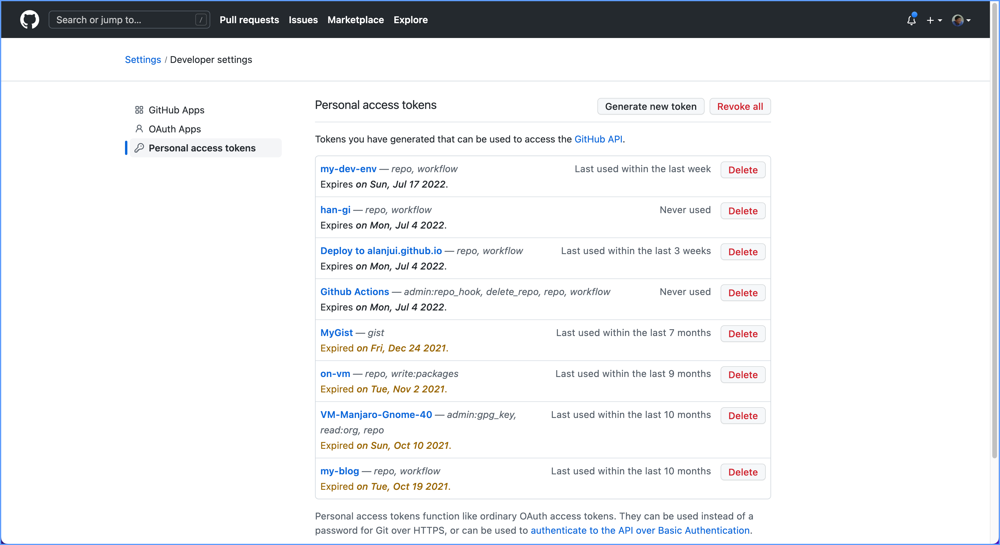
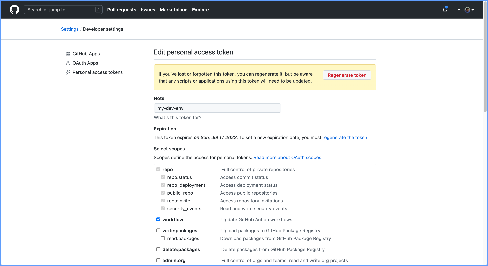
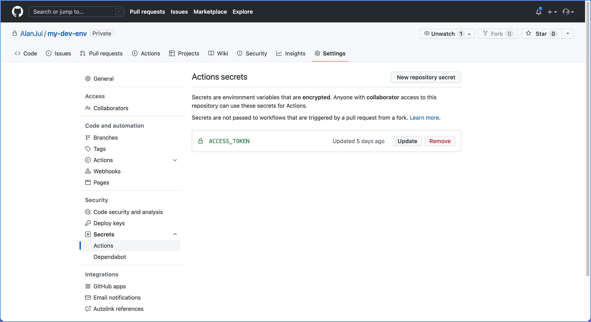
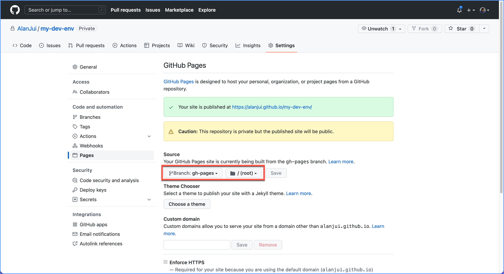

---
sidebar:auto
---

# 將 VuePress 文件佈署至 GitHub

## 摘要

GitHub 提供之 GitHub Pages 功能，可令每個「檔案倉」(Repo) ，亦可視作一個僅只提供
檔案讀取的「靜態 Web 網站」。

例如：敞人在 GitHub 的「使用者帳號」為：AlanJui ；我在 GitHub 建置的檔案倉（Repo）
名為： my-dev-env 。經變更 Repo 的「預設」後，該 Repo 的 GitHub Pages 功能已被啟
用，則此 GitHub Repo 亦成為了一個「靜態網站」，其網址為：
[https://alanjui.github.io/my-dev-env](https://alanjui.github.io/my-dev-denv)。

## GitHub 設定作業

### 設定 Secrets

1. 添加 Personal access tokens 設定。

/<GitHub_User_Account>/Settings/Developer settings/Personal access
tokens/Generate new token



2. 設定 Token 的使用權限。

Token scopes:
- repo (all)
- workflow



### 設定 GitHub Action 作業環境

1. 設定 GitHub Action 作業時，所使用的 Screts（Personal Access Token）。
以便 GitHub 可驗證其「使用及存取權限」。

   - /Repo/Settings/Security/Secrets/Actions/New repository secret

   【註】：完成設定儲存時，其名稱應為：ACCESS_TOKEN 。



2. 設定組建作業，取自 Repo 的那個 Branch

GitHub Pages 之組建(Build)作業，可透過「GitHub Action」功能達成。因為每個
檔案倉(Repo) 可附帶好幾個「分支（Branch）」，故以下之設定，主在告知 Repo ，
產生 GitHub Pages 靜態網頁，應自那個 Branch 取用。

- Repo/Settings/Code and automation/Pages/Source
  * Branch: gh-pages
  * Dir: /(root)



## 設定檔

### package.json

檢查 Node.js 套件管理設定檔，具備執行〖yarn build〗指令的腳本設定。

```json
{
  "name": "my-dev-env",
  "version": "1.0.0",
  "main": "index.js",
  "license": "MIT",
  "scripts": {
    "docs:dev": "vuepress dev docs",
    "docs:build": "vuepress build docs",
    "build": "vuepress build docs",
    "review": "live-server docs/.vuepress/dist",
    "release": ". publish.sh"
  },
  "devDependencies": {
    "live-server": "^1.2.2",
    "vuepress": "^1.9.7"
  }
}
```

### vuepress-deploy.yml

在 VuePress 專案的「根目錄」，建置 GitHub Action 專用的「佈署用腳本」設定檔。

- 目錄路徑：`<ProjectRoot>/.github/workflows/`
- 檔案名稱：`vuepress-deploy.yml` 

```yaml
name: Build and Deploy
on: [push]
jobs:
  build-and-deploy:
    runs-on: ubuntu-latest
    steps:
    - name: Checkout
      uses: actions/checkout@master

    - name: vuepress-deploy
      uses: jenkey2011/vuepress-deploy@master
      env:
        ACCESS_TOKEN: ${{ secrets.ACCESS_TOKEN }}
        TARGET_REPO: AlanJui/my-dev-env
        TARGET_BRANCH: gh-pages
        BUILD_SCRIPT: yarn && yarn build
        BUILD_DIR: docs/.vuepress/dist
        CNAME: https://alanjui.github.io/my-dev-env/
```

【設定作業查核事項】：

1. 變更 `TARGET_REPO` 欄。

2. 確認 `TARGET_BRANCH` 欄，其值應為： `gh-pages` ，不是 `main` ；或 `master` 。

3. 確認 `BUILD_SCRIPT` 欄之設定值。此處之設定值，應用 package.json 檔，第 8 行
   之設定。由於 VuePress 官網之 Quick Start 教學，其示範例所建立之 script 名稱為：
   `docs:build` ；而非 `build` 。遇此情況，建議將 package.json 檔內之 script 名
   自 `docs:build` 變更成 `build` 。

4. 若有必要，變更 `CNAME` 欄之設定值。不然，整行刪除亦可。
