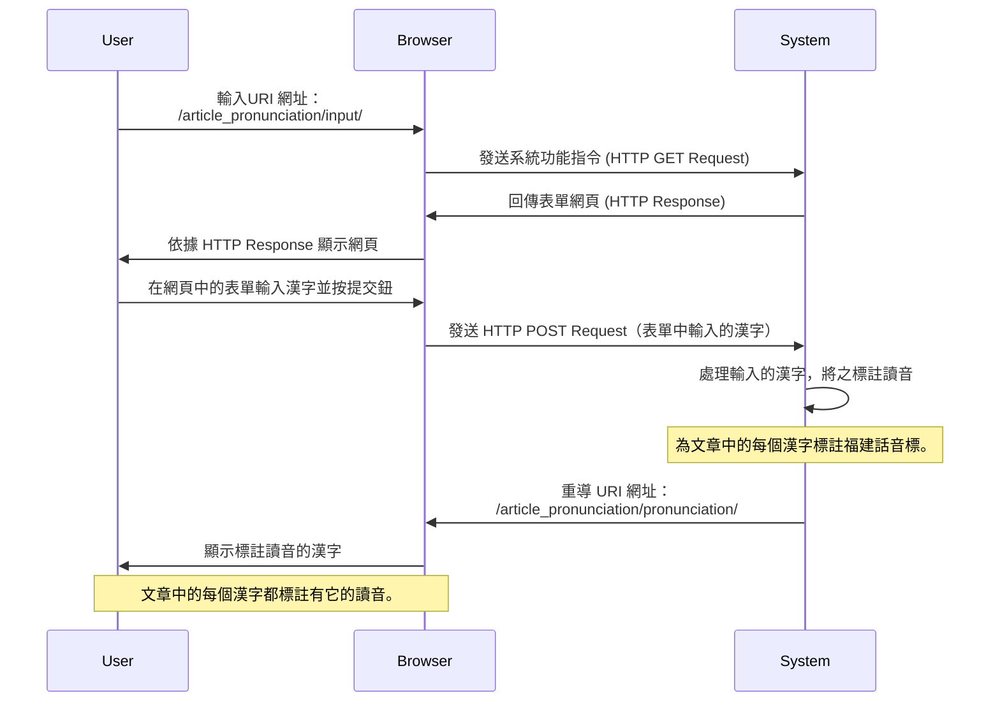

<!-- markdownlint-disable MD024 MD029 MD040 MD041 MD043 MD045 MD033 -->

# 應用系統佈署作業指引

## 摘要

說明如何在 Ubuntu 作業系統，佈署 Django 應用系統。

本指引文件共分兩篇：

- 建置 Django 應用系統運作平台
- 佈署 Django 應用系統作業指引

### 應用系統服務架構


應用系統之運作，由下列三項服務(Services)協同作業：

- HTTP Service: 由 Ngnix 擔綱，作為 HTTP Server ；

- WSGI Service: WSGI（Web Server Gateway Interface）由 uWSGI
  擔鋼，作為 HTTP Serive 與 Application Service 的溝通中介；

- Application Service: 此即所欲佈署之 Django Application。

### 應用系統通訊流程

1. Web Client 發送 HTTP Request；

2. HTTP Service (Nginx) 於收到 HTTP Request 後，將提供「靜態
   檔案」 (Static Files) 予 Web Client ；或是將 HTTP Request
   打包成：「檔案類型」 之 Unix Socket ，然後轉交
   Application Service (uWSGI) 處理；

3. Application Service 自檔案讀取 Unix Socket 內容，並轉發予
   Django Application 處理此發自 Web Client 端之 HTTP
   Request。

<mermaid/>



## 作業指引

### [平台建置作業指引](./deploy-django-app-s01.md)

說明如何在 Ubuntu 作業系統，建置 Django 應用系統於執行時期，
所需使用之運作平台。

### [應用系統佈署作業指引](./deploy-django-app-s02.md)

說明 Django 應用系統，如何佈署之作業程序。

## 問題診斷與狀況排除

### 常用服務管理指令

```
sudo service nginx status
sudo service nginx stop
sudo service nginx start
```

### 驗證設定檔語法正確

建立或變更 nginx.conf 、虛擬網站設定檔後，可使用如下指令驗證
有無「設定語法」的 錯誤。

```
sudo nginx -t
```

📺

```
$ sudo nginx -t
nginx: the configuration file /etc/nginx/nginx.conf syntax is ok
nginx: configuration file /etc/nginx/nginx.conf test is successful
```

## 參考資料

### [Setting up Django and your web server with uWSGI and nginx](https://uwsgi-docs.readthedocs.io/en/latest/tutorials/Django_and_nginx.html?fbclid=IwAR2NF6La2CNVljdTPr79dg4zy9S91e0pkyHqp8zTkj0DihpLrGoL04-lyzc)

如何使用 Nginx + uWSGI 佈署 Django 應用系統。

### [How To Set Up uWSGI and Nginx to Serve Python Apps on CentOS 7](https://www.digitalocean.com/community/tutorials/how-to-set-up-uwsgi-and-nginx-to-serve-python-apps-on-centos-7)

如何運用作業系統所提供之功能，令 Django 應用系統於「開機」後
自動啟動，開始提供服務。
