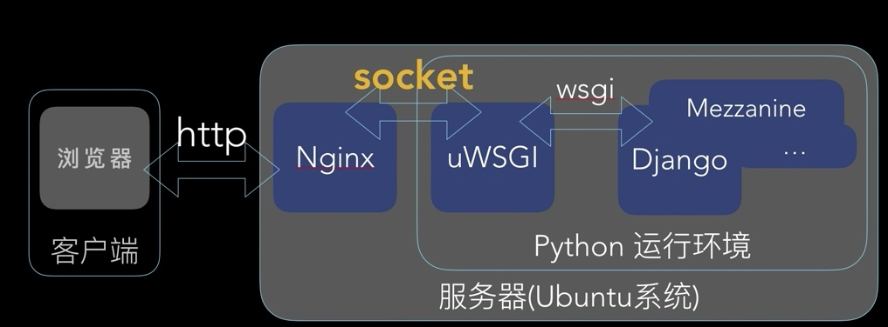

<!-- markdownlint-disable MD024 MD029 MD040 MD041 MD043 MD045 MD033 -->

# 應用系統建置作業指引

## 摘要

說明：如何在 Ubuntu 作業系統，建置 Django 應用系統於執行時期
，所需使用之運作平台。

### Django 應用系統作業平台

- HTTP 伺服器： Nginx
- uWSGI 介面： 將 Nginx 收到之 HTTP Request 轉成 unix socket
  ，並傳送予 Django 應用系統
- Django App： Django 應用系統



### Django 應用系統目錄結構


## 作業程序

### （1）安裝 nginx 作為 HTTP Server

1. 安裝 nginx 套件。

```
sudo apt install nginx -y
```

2. 驗證 nginx 服務已完成安裝，且被正常啟動。

檢驗服務已被啟動，且能隨作業系統開機，自行啟動；

```
systemctl status nginx
```

📺

```
alanjui@VB02-Ubuntu-2004:~$ systemctl status nginx
● nginx.service - A high performance web server and a reverse proxy server
     Loaded: loaded (/lib/systemd/system/nginx.service; enabled; vendor preset: enabled)
     Active: active (running) since Fri 2021-03-26 14:30:00 CST; 1min 10s ago
       Docs: man:nginx(8)
   Main PID: 67493 (nginx)
      Tasks: 3 (limit: 4653)
     Memory: 4.8M
     CGroup: /system.slice/nginx.service
             ├─67493 nginx: master process /usr/sbin/nginx -g daemon on; master_process on;
             ├─67494 nginx: worker process
             └─67495 nginx: worker process

 3月 26 14:30:00 VB02-Ubuntu-2004 systemd[1]: Starting A high performance web server and a reverse proxy ser>
 3月 26 14:30:00 VB02-Ubuntu-2004 systemd[1]: Started A high performance web server and a reverse proxy serv>
lines 1-14/14 (END)
```

3. 檢驗 Web Client 端，已能連上由 nginx 服務建構而成之 HTTP
   Server 。

使用 Web 瀏覽器，瀏覽如下網址，若能正常閱讀「網頁」內容，則
表 HTTP Server 已能 正常運作。

```
http://[IP_Address]
```

### （2）建置使用之 Host Name 與 IP

在 Host 清單（檔案：/etc/hosts），建置 Django 應用系統之
Host Name 及使 用之 IP 。

1. 編輯 Host 清單。

```
sudoedit /etc/hosts
```

2. 添加一筆 Host 與 IP 對映紀錄。

```
127.0.0.1       localhost
127.0.0.1       SRV-2020
192.168.66.10   app.ccc.tw.local
```

### （3）建置應用系統網站

nginx 提供的「虛擬網站」功能，可令一台 HTTP 伺服器，建置及執
行多個網站。 每個 Django 應用系統，均會有： .css 樣式檔、
.html 網頁模版檔、.png/.jpg 圖檔... 等靜態檔案，考慮到應用系
統之執行效能，當 Web Client 傳來之 HTTP Request ，若處理的結
果只需回送「靜態檔案」，供 Web Client 下載，則此作業 之執行
由專職的 HTTP 服務來執行，會有較佳之效能表現，故而交由 nginx
擔綱 負責。

以下之操作，將說明：當 nginx 服務已於伺服器完成安裝後，該如
何作業，完成 Django 應用系統之 HTTP 網站。

1. 建置「網站目錄」。

```
sudo su
mkdir /var/www/app.ccc.tw.local && cd $_
echo "app.ccc.tw.local Web Site" > index.html
```

2. 套用 defaut 虛擬網站設定檔，建置 Django 應用系統網站。

```
cd /etc/nginx/sites-available
cp default app.ccc.tw.local
vim  app.ccc.tw.local
```

🔖 app.ccc.tw.local:

```
server {
    listen 80;

    server_name app.ccc.tw.local;

    root /var/www/app.ccc.tw.local;
    index index.html;

    location / {
        try_files $uri $uri/ =404;
    }
}
```

3. 停用 Default 虛擬網站

```
cd  ../sites-enabled
unlink default
```

4. 啟用 Django 應用系統網站

```
ln -s /etc/nginx/sites-available/app.ccc.tw.local /etc/nginx/sites-enabled
```

5. 檢驗 Django 應用系統網站之設定無誤，確保網站不會因設定有
   錯，以致無法啟動。

```
nginx -t
```

6. 重啟 nginx 服務，以便新進建置之 Django 應用系統網站，已能
   正常運作。

```
systemctl restart nginx
systemclt status nginx
```

7. 驗證 Django 應用系統網站已能正常運作。

使用 Web 瀏覽器，瀏覽網址： <http://app.ccc.tw.local/> 。透
過「檢視」，觀察網頁 顯示內容的結果，以此方式驗證 Django 應
用系統網站，已完成設定，可正常運作。

【網頁應顯示之內容】：

```
app.ccc.tw.local Web Site
```

### （4）設定管理者帳號

在作業系統，建立 Django 應用系統管理員，其「使用者帳號」及歸
屬之「群組」。

1. 新增管理者用使用者帳號，並設為 sudo 群組。

```
sudo adduser web-admin
usermod -aG sudo web-admin
```

將管理者帳號加入 www-data 群組先登出，再以「管理者帳號」登入
。

```
sudo usermod -aG www-data $USER
```

3. 驗證設定成功：

先登出，再登入。然後執行以下指令，驗證管理者帳號屬
：sudo、www-data 群組。

```
groups
id
```

📺

```
web-admin@VB02-Ubuntu-2004:~$ cat /etc/group | grep www-data
www-data:x:33:

web-admin@VB02-Ubuntu-2004:~$ groups
web-admin adm cdrom sudo dip www-data plugdev lpadmin lxd sambashare

web-admin@VB02-Ubuntu-2004:~$ id
使用者id=1000(web-admin) id群組=1000(web-admin) 組=1000(web-admin),4(adm),24(cdrom),27(sudo),30(dip),33(www-data),46(plugdev),120(lpadmin),131(lxd),132(sambashare)
```

## 啟用 HTTPS 通信協定

### （1）安裝「憑證用套件」

```
$ sudo add-apt-repository ppa:certbot/certbot
$ sudo apt update
$ sudo apt upgrade
$ sudo apt install python-certbot-nginx
s sudo cerbot --nginx -d ccc99.tw -d www.ccc99.tw
```

📺

```
$ sudo cerbot --nginx -d ccc99.tw -d www.ccc99.tw
sudo: cerbot: command not found
juzhengzhong@SRV-01:~$ sudo certbot --nginx -d ccc99.tw -d www.ccc99.tw
Saving debug log to /var/log/letsencrypt/letsencrypt.log
Plugins selected: Authenticator nginx, Installer nginx
Enter email address (used for urgent renewal and security notices) (Enter 'c' to
cancel): alanjui.1960@gmail.com

- - - - - - - - - - - - - - - - - - - - - - - - - - - - - - - - - - - - - - - -
Please read the Terms of Service at
https://letsencrypt.org/documents/LE-SA-v1.2-November-15-2017.pdf. You must
agree in order to register with the ACME server at
https://acme-v02.api.letsencrypt.org/directory
- - - - - - - - - - - - - - - - - - - - - - - - - - - - - - - - - - - - - - - -
(A)gree/(C)ancel: a

- - - - - - - - - - - - - - - - - - - - - - - - - - - - - - - - - - - - - - - -
Would you be willing to share your email address with the Electronic Frontier
Foundation, a founding partner of the Let's Encrypt project and the non-profit
organization that develops Certbot? We'd like to send you email about our work
encrypting the web, EFF news, campaigns, and ways to support digital freedom.
- - - - - - - - - - - - - - - - - - - - - - - - - - - - - - - - - - - - - - - -
(Y)es/(N)o: n
Obtaining a new certificate
Performing the following challenges:
http-01 challenge for ccc99.tw
http-01 challenge for www.ccc99.tw
Waiting for verification...
Cleaning up challenges
Deploying Certificate to VirtualHost /etc/nginx/sites-enabled/django2_helloworld.conf
Deploying Certificate to VirtualHost /etc/nginx/sites-enabled/django2_helloworld.conf

Please choose whether or not to redirect HTTP traffic to HTTPS, removing HTTP access.
- - - - - - - - - - - - - - - - - - - - - - - - - - - - - - - - - - - - - - - -
1: No redirect - Make no further changes to the webserver configuration.
2: Redirect - Make all requests redirect to secure HTTPS access. Choose this for
new sites, or if you're confident your site works on HTTPS. You can undo this
change by editing your web server's configuration.
- - - - - - - - - - - - - - - - - - - - - - - - - - - - - - - - - - - - - - - -
Select the appropriate number [1-2] then [enter] (press 'c' to cancel): 2
Redirecting all traffic on port 80 to ssl in /etc/nginx/sites-enabled/django2_helloworld.conf
Redirecting all traffic on port 80 to ssl in /etc/nginx/sites-enabled/django2_helloworld.conf

- - - - - - - - - - - - - - - - - - - - - - - - - - - - - - - - - - - - - - - -
Congratulations! You have successfully enabled https://ccc99.tw and
https://www.ccc99.tw

You should test your configuration at:
https://www.ssllabs.com/ssltest/analyze.html?d=ccc99.tw
https://www.ssllabs.com/ssltest/analyze.html?d=www.ccc99.tw
- - - - - - - - - - - - - - - - - - - - - - - - - - - - - - - - - - - - - - - -

IMPORTANT NOTES:
 - Congratulations! Your certificate and chain have been saved at:
   /etc/letsencrypt/live/ccc99.tw/fullchain.pem
   Your key file has been saved at:
   /etc/letsencrypt/live/ccc99.tw/privkey.pem
   Your cert will expire on 2019-07-01. To obtain a new or tweaked
   version of this certificate in the future, simply run certbot again
   with the "certonly" option. To non-interactively renew *all* of
   your certificates, run "certbot renew"
 - Your account credentials have been saved in your Certbot
   configuration directory at /etc/letsencrypt. You should make a
   secure backup of this folder now. This configuration directory will
   also contain certificates and private keys obtained by Certbot so
   making regular backups of this folder is ideal.
 - If you like Certbot, please consider supporting our work by:

   Donating to ISRG / Let's Encrypt:   https://letsencrypt.org/donate
   Donating to EFF:                    https://eff.org/donate-le
```

### （2）虛擬網站啟用 HTTPS 通信協定

設定 nginx 虛擬網站，使之與「憑證」結合，以便啟用 HTTPS 通信
協定。

```
{
    # configuration of the server
    server {
        # the port your site will be served on
        # the domain name it will serve for
        #server_name     .example.com; # substitute your machine's Ip address or FQDN
        #server_name     192.168.66.10;
        server_name     ccc99.tw www.ccc99.tw;
        charset         utf8-8;

        # max upload size
        client_max_body_size 75M;  # adjust to taste

        location = /favicon.ico {
            access_log      off;
            log_not_found   off;
        }

        # Django media
        location /media {
            # your Django project's media files - amend as required
            #root   /home/juzhengzhong/workspace/django2_helloworld;
            alias   /home/juzhengzhong/workspace/django2_helloworld/media;
        }

        location /static {
            alias   /home/juzhengzhong/workspace/django2_helloworld/web_site/staticfiles;
        }

        # Finally, send all non-media requests to the Django server
        location / {
            include     uwsgi_params; # should be located in /etc/nginx/
            uwsgi_pass  unix:/home/juzhengzhong/uwsgi/django2_helloworld.sock;
        }

        listen 443 ssl; # managed by Certbot
        ssl_certificate /etc/letsencrypt/live/ccc99.tw/fullchain.pem; # managed by Certbot
        ssl_certificate_key /etc/letsencrypt/live/ccc99.tw/privkey.pem; # managed by Certbot
        include /etc/letsencrypt/options-ssl-nginx.conf; # managed by Certbot
        ssl_dhparam /etc/letsencrypt/ssl-dhparams.pem; # managed by Certbot
    }

    server {
        if ($host = www.ccc99.tw) {
            return 301 https://$host$request_uri;
        } # managed by Certbot


        if ($host = ccc99.tw) {
            return 301 https://$host$request_uri;
        } # managed by Certbot


        listen          80;
        server_name     ccc99.tw www.ccc99.tw;
        return 404; # managed by Certbot
    }
}
```

### （3）測試 HTTPS 已能正常運作

透過 SSL Server Test (opens new window)網站，測試 設定結果正
確無誤，Web Server 已啟用了 HTTPS 通信協定。

## 常見作業

### 常用服務管理指令

```
sudo service nginx status
sudo service nginx stop
sudo service nginx start
```

### 驗證設定檔語法正確

建立或變更 nginx.conf 、虛擬網站設定檔後，可使用如下指令驗證
有無「設定語法」的 錯誤。

```
sudo nginx -t
```

📺

```
$ sudo nginx -t
nginx: the configuration file /etc/nginx/nginx.conf syntax is ok
nginx: configuration file /etc/nginx/nginx.conf test is successful
```

## 問題診斷與狀況排除

N/A

## 參考資料

如何運用 Nginx 、uWSGI 服務，搭建 Django 應用系統之參考資料
。

- [Setting up Django and your web server with uWSGI and nginx](https://uwsgi-docs.readthedocs.io/en/latest/tutorials/Django_and_nginx.html?fbclid=IwAR2NF6La2CNVljdTPr79dg4zy9S91e0pkyHqp8zTkj0DihpLrGoL04-lyzc)

- [How To Set Up uWSGI and Nginx to Serve Python Apps on CentOS 7](https://www.digitalocean.com/community/tutorials/how-to-set-up-uwsgi-and-nginx-to-serve-python-apps-on-centos-7)

如何運用作業系統所提供之功能，令 Django 應用系統可於「開機作
業」完成後，便能自動啟動，開始提供服務。

- [How to use /etc/rc.local at boot](https://linuxhint.com/use-etc-rc-local-boot/)

如何在區域網路，快速建置 DNS 服務，令 Web Client 可透過 FQDN
（非 IP 之 Host Name），使用 Django 應用系統所提供之服務。

- [Install and Configure Dnsmasq on Ubuntu 22.04|20.04|18.04](https://computingforgeeks.com/install-and-configure-dnsmasq-on-ubuntu/)

### 設定 Nginx 作業環境

設定 Nginx 在作業系統的執行環境。

編輯設定檔。

```
sudo nano /etc/nginx/nginx.conf
```

nginx.conf 設定：

```
user www-data;
worker_processes auto;
pid /run/nginx.pid;
include /etc/nginx/modules-enabled/*.conf;

events {
    worker_connections 768;
    # multi_accept on;
}

http {
    ##
    # Basic Settings
    ##

    sendfile on;
    tcp_nopush on;
    tcp_nodelay on;
    keepalive_timeout 65;
    types_hash_max_size 2048;
    # server_tokens off;

    server_names_hash_bucket_size 64;
    # server_name_in_redirect off;

    include /etc/nginx/mime.types;
    default_type application/octet-stream;

    ##
    # SSL Settings
    ##

    ssl_protocols TLSv1 TLSv1.1 TLSv1.2; # Dropping SSLv3, ref: POODLE
    ssl_prefer_server_ciphers on;

    ##
    # Logging Settings
    ##

    access_log /var/log/nginx/access.log;
    error_log /var/log/nginx/error.log;

    ##
    # Gzip Settings
    ##

    gzip on;
    gzip_disable "msie6";

    # gzip_vary on;
    # gzip_proxied any;
    # gzip_comp_level 6;
    # gzip_buffers 16 8k;
    # gzip_http_version 1.1;
    # gzip_types text/plain text/css application/json application/javascript text/xml application/xml application/xml+rss text/javascript;

    ##
    # Virtual Host Configs
    ##

    include /etc/nginx/conf.d/*.conf;
    include /etc/nginx/sites-enabled/*;
}
```

驗證設定檔內容無誤

```
sudo nginx -t
```

# app1.ccc.tw.local 之 nginx 設定檔

/etc/nginx/sites-available/app1.ccc.tw.local

# 在 Ubuntu 18.04 安裝 Nginx

How to Install Nginx on Ubuntu 18.04(opens new window)

/etc/nginx/sites-available/app1.ccc.tw.local

```
upstream django {
 # server 127.0.0.1:8001;
    server unix:///home/alanjui/workspace/apps/django-v4/mysite.sock;
}

server {
 listen 8000;

 server_name  app1.ccc.tw.local;
 charset  utf-8;

 # max upload size
 client_max_body_size 75M;

 # Django media
 location /media {
  alias /home/alanjui/workspace/apps/django-v4/media;
 }

 location /static {
  alias /home/alanjui/workspace/apps/django-v4/static_collected;
 }

 location / {
  uwsgi_pass django;
  include  /home/alanjui/workspace/apps/django-v4/uwsgi_params;
 }

 # root   /var/www/app1.ccc.tw.local;
 # index   index.html;
 # access_log   /var/log/nginx/app1-ccc-tw-local.log;
 # error_log    /var/log/nginx/app1-ccc-tw-local-error.log;

 # location / {
 #  try_files $uri $uri/ =404;
 # }
}
```

/home/alanjui/workspace/apps/django-v4/mysite_uwsgi.ini

```
[uwsgi]

# Django-related settings
# the base directory
chdir               = /home/alanjui/workspace/apps/django-v4
# Django's wsgi file
module              = mysite.wsgi
# the virtualenv
home                = /home/alanjui/.pyenv/versions/3.10.0/envs/django-4.0/

# process-related settings
# master
master              = true
# maximum number of worker processes
processes           = 10
# the socket
socket              = /home/alanjui/workspace/apps/django-v4/mysite.sock
# ... with appropriate permissions
chmod-socket        = 666
# clear environment on exit
vacuum              = true
```

/etc/systemd/system/app1.service

```
[Unit]
Description=uWSGI instance to serve app1.ccc.tw.local

[Service]
ExecStartPre=-/usr/bin/bash -c 'mkdir -p /run/uwsgi; chown www-data:www-data /run/uwsgi'
ExecStart=/usr/bin/bash -c 'cd /home/alanjui/workspace/apps/django-v4; \
/home/alanjui/.pyenv/bin/pyenv activate django-v4; \
/home/alanjui/.pyenv/versions/django-4.0/bin/uwsgi --ini mysite_uwsgi.ini'

[Install]
WantedBy=multi-user.target
```
