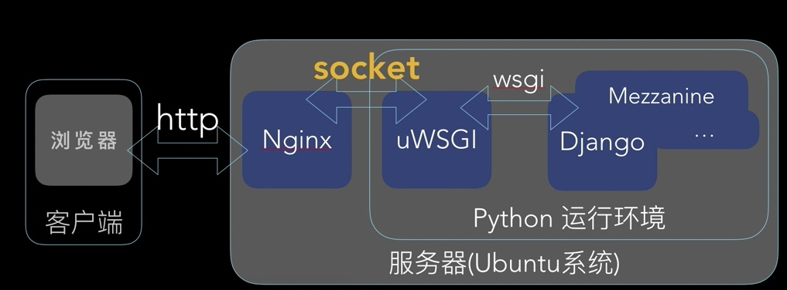
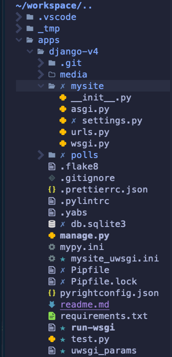

<!-- markdownlint-disable MD024 MD029 MD040 MD041 MD043 MD045 MD033 -->

# 應用系統佈署作業

## 摘要

如何在 Django Application 作業平台，佈署應用系統。

### Django 應用系統作業平台

- HTTP 伺服器： Nginx
- uWSGI 介面： 將 Nginx 收到之 HTTP Request 轉成 unix socket
  ，並傳送予 Django 應用系統
- Django App： Django 應用系統



### Django 應用系統目錄結構



## 作業程序

### 自 Git Repo 下載原始碼

自 GitHub 下載及安裝 Django 應用系統。

1. 自 GitHub 下載原始碼。

   ```sh
   cd /apps
   git clone git@github.com:AlanJui/Django4-Project-Template.git app1.ccc.tw.local
   cd Django4
   ```

2. 建置 Python 虛擬環境

   ```sh
   pyenv version
   python -m venv .venv
   poetry shell
   ```

3. 安裝 Python 套件。

   ```sh
   poetry install
   ```

4. 組建 Django 應用系統。

   ```sh
   python manage.py migrate
   python manage.py collectstatic
   ```

5. 建立 Django 應用系統之「後台管理員」。

   ```sh
   python manage.py createsuperuser
   ```

### 驗證 Django Server 已能運作

1. 啟動 Django Web Server。

   ```sh
   python manage.py runserver 0.0.0.0:8000
   ```

2. 在瀏覽器輸入以下網址，以此方式驗 證 Django 應用系統在
   Debug 模式，已能正常運作。

   ```
   http://127.0.0.1:8000/
   ```

### 建置 HTTP 虛擬網站

建置 HTTP 虛擬網站，供 Django 應用系統，處理 static 型態檔案
。

1. 建置 Django 應用系統之 Host 名稱

   ```sh
   sudoedit /etc/hosts
   ```

   `/etc/hosts`:

   ```
   192.168.66.10   app1.ccc.tw.local
   ```

2. 建置 Nginx 虛擬網站設定檔。

   ```sh
   cd /etc/nginx/site-available
   sudo cp default app1.ccc.tw.local
   sudoedit app1.ccc.tw.local
   ```

   /etc/nginx/sites-available/app1.ccc.tw.local:

   ```sh
   upstream app1 {
       # server 127.0.0.1:8001;
       server unix:///apps/app1.ccc.tw.local/app1.sock;
   }

   server {
       listen 80;

       server_name             app1.ccc.tw.local;
       charset                 utf-8;

       # max upload size
       client_max_body_size    75M;

       # Django media
       location /media {
           alias        /apps/app1.ccc.tw.local/media;
       }

       location /static {
           alias        /apps/app1.ccc.tw.local/static_collected;
       }

       location / {
           uwsgi_pass   django;
           include      /apps/app1.ccc.tw.local/uwsgi_params;
       }

       access_log      /var/log/nginx/app1-ccc-tw-local.log;
       error_log       /var/log/nginx/app1-ccc-tw-local-error.log;
   }
   ```

3. 檢測設定檔，確認內容無誤。

   ```sh
   sudo nginx -t
   ```

### 啟用 HTTP 虛擬網站

1. 建立啟用 nginx 虛擬網站之 symlink 。

   ```sh
   sudo ln -fns /etc/nginx/sites-available/app1.ccc.tw.local
   /etc/nginx/sites-enable
   ```

2. 重啟 nginx 服務。

   ```sh
   sudo systemctl restart nginx
   sudo systemctl status nginx
   ```

### 驗證 HTTP 虛擬網站已能運作

在 Web 用戶端，透過「瀏覽器」發送 HTTP Request，要求瀏覽某靜
態檔案（如：.html / .css / .jpg / .png / ...），若瀏覽器能顯
示該靜態檔案的內容，即代表 Nginx 所建置的「虛擬網站」，已能
正常作業，對於 HTTP Request 要求，能提供相對映，應有之 HTTP
Response 。

在瀏覽器輸入以下網址，要求瀏覽 style.css 靜態檔。

```sh
http://app1.ccc.tw.local/static/css/site.css
```

### 建置 uWSGI 介面設定檔

WSGI 是 Python Web 應用系統介面，當 HTTP 虛擬網站對於無法處
理的 HTTP Request ，將之轉換為 web sock 轉予 Django
Application 處理。

```sh
upstream app1 {
    # server 127.0.0.1:8001;
    server unix:///apps/app1.ccc.tw.local/app1.sock;
}
......
```

此步驟的主要目的，用於建立下列所示之 HTTP Request 傳送通道：

```sh
web client <-> web server <-> unix socket <-> uWSGI <-> Python
                (Nginx)                      (uwsgi)   (Django)
```

1. 透過 poetry 套件管理工具，安裝 python 套件：uwsgi 。

   ```sh
   poetry add uwsgi
   ```

2. 建置 uwsgi 用設定檔：web_app_uwsgi.ini 。

   `/apps/app1.ccc.tw.local/web_app_uwsgi.ini`：

   ```sh
   [uwsgi]
   # Django-related settings
   # the base direc
   chdir               = /apps/app1.ccc.tw.local
   # Django's wsgi file
   module              = web_app.wsgi
   # the virtualenv
   home                = /apps/app1.ccc.tw.local
   # process-related settings
   # master
   master              = true
   # maximum number of worker processes
   processes           = 10
   # the socket
   socket              = /apps/app1.ccc.tw.local/app1.sock
   # ... with appropriate permissions
   chmod-socket        = 666
   # clear environment on exit
   vacuum              = true
   ```

3. 複製 nginx 所提供的 uwsgi 設定檔：uwsi_params

   ```sh
   sudo cp /etc/nginx/uwsgi_params .
   chown www-data:www-data uwsgi_params
   ```

### 驗證應用系統已整合

驗證 Nginx + uWSGI + Django App 已完成整合。

1. 執行 uwsgi 。

   ```sh
   .venv/bin/uwsgi --ini web_app_uwsgi.ini
   ```

2. 透過瀏覽器，驗證 HTTP Request 已能循下列路徑運作： nginx
   <--> uwsgi <--> Django App 。

   在瀏覽器輸入以下網址：

   ```sh
   http://app1.ccc.tw.local/
   ```

### 建置自動開機服務

為使已佈署之 Django 應用系統，能於開機後自動啟動。故需建置及
啟用 Django 應用系統專用之服務。

1. 建置 app1 服務設定檔。

   ```sh
   sudoedit /etc/systemd/system/app1.service
   ```

   【檔案內容】：

   ```sh
   [Unit]
   Description=uWSGI instance to serve app1.ccc.tw.local

   [Service]
   ExecStartPre=-/usr/bin/bash -c 'mkdir -p /run/uwsgi; chown www-data:www-data /run/uwsgi'
   ExecStart=/usr/bin/bash -c 'cd /apps/app1.ccc.tw.local; \
   .venv/bin/uwsgi --ini web_app_uwsgi.ini'

   [Install]
   WantedBy=multi-user.target
   ```

2. 啟用 app1 服務。

   ```sh
   sudo systemctl enable app1
   sudo systemctl start app1
   ```

3. 檢視 app1 服務，確認該服務已能正常運作。

   ```sh
   sudo systemctl status app1
   ```

   【app1 服務狀態】：

   ```
   ● app1.service - uWSGI instance to serve app1.ccc.tw.local
       Loaded: loaded (/etc/systemd/system/app1.service; enabled; vendor preset: enabled)
       Active: active (running) since Tue 2022-07-05 08:21:43 CST; 1h 54min ago
       Process: 3839 ExecStartPre=/usr/bin/bash -c mkdir -p /run/uwsgi; chown www-data:www-data /run/uwsgi (code=exited, status=0/SUCCESS)
     Main PID: 5067 (bash)
         Tasks: 12 (limit: 19083)
       Memory: 90.0M
       CGroup: /system.slice/app1.service
               ├─5067 /usr/bin/bash -c cd /home/alanjui/workspace/apps/django-v4;  /home/alanjui/.pyenv/bin/pyenv activate django-v4;  /home/alanju>
               ├─5103 /home/alanjui/.pyenv/versions/django-4.0/bin/uwsgi --ini mysite_uwsgi.ini
               ├─6654 /home/alanjui/.pyenv/versions/django-4.0/bin/uwsgi --ini mysite_uwsgi.ini
               ├─6655 /home/alanjui/.pyenv/versions/django-4.0/bin/uwsgi --ini mysite_uwsgi.ini
               ├─6657 /home/alanjui/.pyenv/versions/django-4.0/bin/uwsgi --ini mysite_uwsgi.ini
               ├─6658 /home/alanjui/.pyenv/versions/django-4.0/bin/uwsgi --ini mysite_uwsgi.ini
               ├─6659 /home/alanjui/.pyenv/versions/django-4.0/bin/uwsgi --ini mysite_uwsgi.ini
               ├─6663 /home/alanjui/.pyenv/versions/django-4.0/bin/uwsgi --ini mysite_uwsgi.ini
               ├─6664 /home/alanjui/.pyenv/versions/django-4.0/bin/uwsgi --ini mysite_uwsgi.ini
               ├─6665 /home/alanjui/.pyenv/versions/django-4.0/bin/uwsgi --ini mysite_uwsgi.ini
               ├─6666 /home/alanjui/.pyenv/versions/django-4.0/bin/uwsgi --ini mysite_uwsgi.ini
               └─6667 /home/alanjui/.pyenv/versions/django-4.0/bin/uwsgi --ini mysite_uwsgi.ini

   7月 05 08:21:44 SRV-2020 bash[5103]: spawned uWSGI worker 5 (pid: 6659, cores: 1)
   7月 05 08:21:44 SRV-2020 bash[5103]: spawned uWSGI worker 6 (pid: 6663, cores: 1)
   7月 05 08:21:44 SRV-2020 bash[5103]: spawned uWSGI worker 7 (pid: 6664, cores: 1)
   7月 05 08:21:44 SRV-2020 bash[5103]: spawned uWSGI worker 8 (pid: 6665, cores: 1)
   7月 05 08:21:44 SRV-2020 bash[5103]: spawned uWSGI worker 9 (pid: 6666, cores: 1)
   7月 05 08:21:44 SRV-2020 bash[5103]: spawned uWSGI worker 10 (pid: 6667, cores: 1)
   7月 05 09:08:11 SRV-2020 bash[6667]: Not Found: /favicon.ico
   7月 05 09:08:11 SRV-2020 bash[6667]: [pid: 6667|app: 0|req: 1/1] 192.168.66.21 () {44 vars in 842 bytes} [Tue Jul  5 01:08:11 2022] GET /favicon>
   7月 05 09:39:34 SRV-2020 bash[6667]: Not Found: /favicon.ico
   7月 05 09:39:34 SRV-2020 bash[6667]: [pid: 6667|app: 0|req: 2/2] 192.168.66.10 () {44 vars in 820 bytes} [Tue Jul  5 01:39:34 2022] GET /favicon>
   ~
   ```

## 參考資料

- [Setting up Django and your web server with uWSGI and nginx](https://uwsgi-docs.readthedocs.io/en/latest/tutorials/Django_and_nginx.html)
