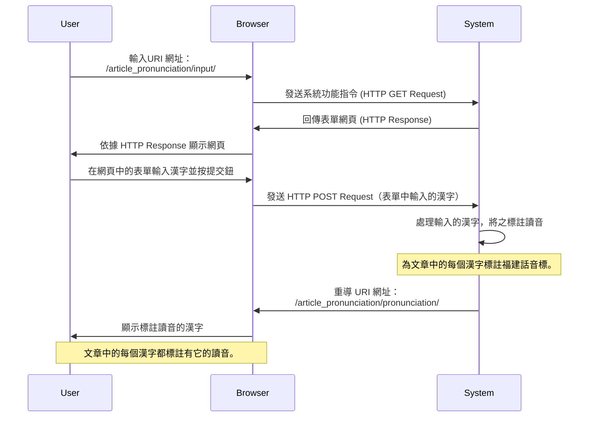
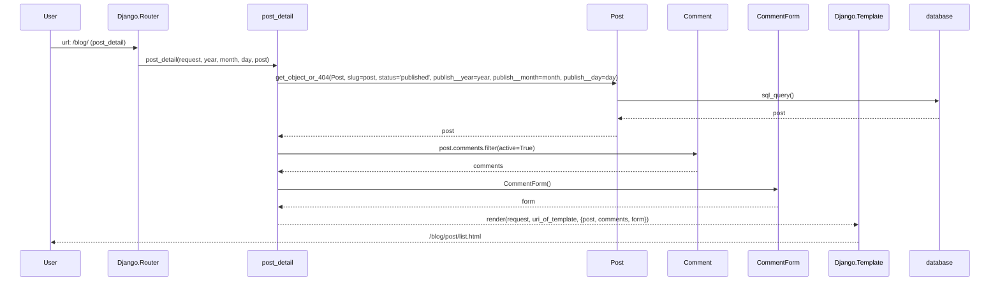
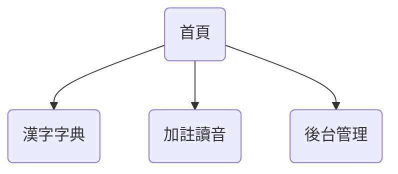
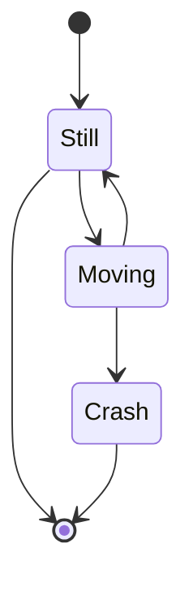

<!-- markdownlint-disable MD024 MD033 MD043 -->

# 為漢字標註讀音

[](https://tinyurl.com/2bkmhu6x)<!---->

## 使用者需求

使用者可輸入一段「漢字」，或一篇文章。系統將為每個漢字標註「
福建話音標」。

### 作業程序

1. 使用者在瀏覽器輸入網址（URI: /article_pronunciation/）。

   【URI 網址】 /article_pronunciation/pronunciation/

2. 系統顯示「輸入文章」表單。

3. 使用者先在表單中輸入文章，然後按《提交》按鈕。

4. 系統處理輸入之文章，為每個漢字標註「福建話音標」。最後，
   向使用者顯示已標註福建話音標之文章。

   【URI 網址】 /article_pronunciation/pronunciation/

## 系統需求規格



## 系統設計規格

<!--  -->

<!-- <center> -->
<!--    -->
<!-- </center> -->

### PlantUML 語法

```plantuml
actor    User
control  Django.Router  as Router
control  Django.Template as Template
boundary post_detail      as View
boundary CommentForm      as Form
entity   Post    as Model
entity   Comment   as Comment
database database   as DB

User -> Router : url: /blog/  (post_detail)
Router -> View : post_detail(request, year, month, day, post)
View -> Model : get_object_or_404(Post, slug=post, \n status='published', publish__year=year, \n publish__month=month, publish__day=day)
Model -> DB : sql_query()
DB --> Model : post
Model --> View : post
View -> Comment: post.comments.filter(active=True)
Comment --> View: comments
View -> Form: CommentForm()
Form --> View: form
View --> Template: render(request, \n uri_of_template, \n {post, comments, form})
Template --> User: /blog/post/list.html
```

### Mermaid 語法

<mermaid />



### 網頁架構

<mermaid />



::: tip A to C: 漢字讀音，取自漢字字典 :::

<mermaid />


