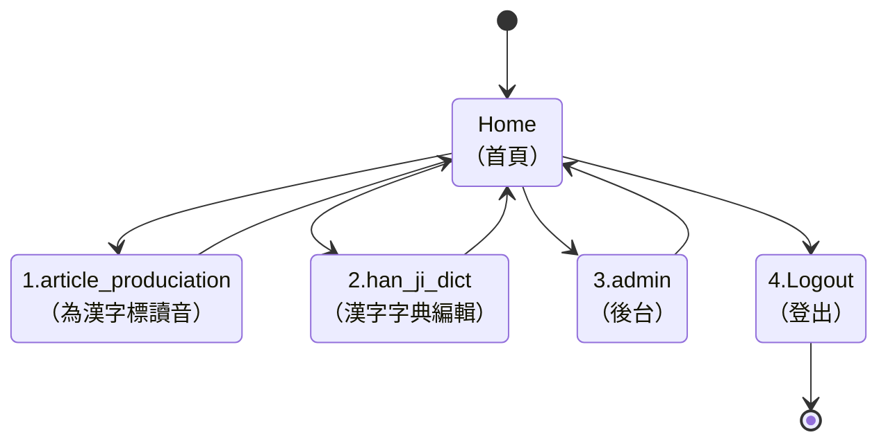

<!-- markdownlint-disable MD024 MD043 -->

# 系統設計規格

使用 Django 開發 Web App 系統，該 Web App 系統含有兩個子應用
（Application）：

- han_ji_dict : 漢字字典，可為漢字輸入音標；
- article_prounciation : 可輸入漢字，由系統在漢字字典查找漢
  字的音標，然後再於畫面顯示已標註音標的漢字。

## 系統設計規範

1. 專案名稱：han_ji

2. 專案執行平台： Python Django 4.1.3

3. Python Intepreter 版本管理工具：pyenv

4. Python Version： 3.10.6

5. Python Package Manager 工具： Poetry

6. Python Virtual Environment

   - 目錄：位於 Project 根目錄下，名為： .venv；
   - 工具：使用 python 內附套件 venv

   ```sh
   poetry run python venv .venv
   ```

## 專案目錄結構

```sh
❯ tree . -L 2
.
├── README.md
├── article_pronunciation
│   ├── __init__.py
│   ├── __pycache__
│   ├── admin.py
│   ├── apps.py
│   ├── migrations
│   ├── models.py
│   ├── templates
│   ├── tests.py
│   ├── urls.py
│   └── views.py
├── db.sqlite3
├── docs
│   ├── OP.md
│   ├── SDD.md
│   ├── SRS.md
│   ├── STS.md
│   └── URS.md
├── han_ji_dict
│   ├── __init__.py
│   ├── __pycache__
│   ├── admin.py
│   ├── apps.py
│   ├── migrations
│   ├── models.py
│   ├── tests.py
│   └── views.py
├── manage.py
├── poetry.lock
├── pyproject.toml
├── setup.cfg
├── tests
│   ├── __init__.py
│   ├── __pycache__
│   ├── fn
│   ├── it
│   └── st
├── tools
│   ├── han_ji.csv
│   ├── import_csv.py
│   ├── import_csv_drop_old_table.py
│   ├── import_csv_to_han_ji_dict.py
│   └── setenv.py
└── web_app
    ├── __init__.py
    ├── __pycache__
    ├── asgi.py
    ├── settings.py
    ├── urls.py
    └── wsgi.py
```

## 建置應用指令

建置 Django Appliction ，請在終端機執行以下 Django 指令。

```sh
django-admin startapp han_ji_dict
django-admin startapp article_pronunciation
```

## 網頁架構

1. 使用者進入此 Web App 時，以 article_prounciation
   Application 的根路徑為網站的首頁；
2. article_prounciation Application 的首頁上有「表單」，可輸
   入漢字，並按「送出」按鈕；系統將依輸入的漢字標註音標，然
   後顯示於畫面下方；
3. 進入 article_prounciation Application 的首頁時，上方「表
   單」的表單已輸入預設的漢字：「我可以為您標註漢字讀音」，
   下方則顯示已標註讀音的漢字。
4. 使用 Django Template 設計 Base View。Base View 中需使用
   HTML nav tag 來設計導覽列，以便使用者可依此導覽列執行系統
   能提供之功能。



## han_ji_dict application

提供前端的 UI ，供使用者可自行編輯漢字字典。

### Application 作業流程

1. 進入 han_ji_dict 的 Home View 時，請以 HTML TABLE 顯示 20
   個漢字字典資料，並提供「上一頁」、「下一頁」的按鈕；
2. Home View 請用 Django View 的 ListView 來實作；
3. 每個漢字均有 Hyper-link ，點擊後將進 Detail View 顯示該漢
   字的詳細資料；
4. Detail View 中需要按鈕，可回到 han_ji_dict Home View；
5. 仿 CRUD 觀點，提供：加漢字資料（C）、改漢字資料（U）、刪
   漢字資料（D）。所有功能均以 Django View Class 完成。在
   Application 的 Home View 均有按鈕；
6. 提供查詢（Query）功能，以便使用者可快速查找某一漢字的讀音
   資料；
7. 提供篩選功能，以便使用者可依讀音的音標，查找相同發音的漢
   字。

#### Models

```python
class HanJi(models.Model):
    # 漢字
    han_ji = models.CharField(max_length=2, default='')
    # 漢字讀音編碼
    chu_im = models.CharField(max_length=10, default='')
    # 讀音常用頻率
    freq = models.FloatField(default=0.0)
    # 聲母碼
    siann = models.CharField(max_length=2, default='')
    # 韻母碼
    un = models.CharField(max_length=5, default='')
    # 調號
    tiau = models.IntegerField(default=0)
    # 原編者使用的 BP 標音
    old_chu_im = models.CharField(max_length=10, null=True)
    # 十五音聲母
    sni_siann = models.CharField(max_length=10, default='')
    # 十五音韻母
    sni_un = models.CharField(max_length=10, default='')

    def __str__(self):
        return self.han_ji
```

### Views

```python
class HanJi(models.Model):
    # 漢字
    han_ji = models.CharField(max_length=2, default='')
    # 漢字讀音編碼
    chu_im = models.CharField(max_length=10, default='')
    # 讀音常用頻率
    freq = models.FloatField(default=0.0)
    # 聲母碼
    siann = models.CharField(max_length=2, default='')
    # 韻母碼
    un = models.CharField(max_length=5, default='')
    # 調號
    tiau = models.IntegerField(default=0)
    # 原編者使用的 BP 標音
    old_chu_im = models.CharField(max_length=10, null=True)
    # 十五音聲母
    sni_siann = models.CharField(max_length=10, default='')
    # 十五音韻母
    sni_un = models.CharField(max_length=10, default='')

    def __str__(self):
        return self.han_ji
```

## article_prounciation application

### Application 作業流程

1. 使用者進入此 Web App 時，以 article_prounciation
   Application 的根路徑為網站的首頁；
2. article_prounciation Application 的首頁上有「表單」，可輸
   入漢字，並按「送出」按鈕；系統將依輸入的漢字標註音標，然
   後顯示於畫面下方；
3. 進入 article_prounciation Application 的首頁時，上方「表
   單」的表單已輸入預設的漢字：「我可以為您標註漢字讀音」，
   下方則顯示已標註讀音的漢字。
4. 使用 Django Template 設計 Base View。Base View 中需使用
   HTML 的 nav tag 來設計導覽列，以便使用者可依此導覽列執行
   系統能提供之功能。

## 資料庫建置

### 匯入 CSV 資料

資料庫之建置，本可透過 Python 程式碼，以此建立資料庫所需使用
的資料表。但字典庫所需建置之資料，已有現成可用之 CSV 檔可供
使用，故專案將以下述之 Python 程式 碼，將 CSV 檔之資料匯入，
用以建置系統所需使用之 han_li_dict_hanji 資料表。

這個程式碼示例與之前的範例很相似，但是不需要建立新的資料表，
而是假設資料庫中已經存在了名為 han_li_dict_hanji 的資料表。
在這種情況下，你只需使用 INSERT INTO 語句將 CSV 資料插入到現
有的資料表中即可。

請注意，這個程式碼示例假設資料庫檔案 db.sqlite3 已經存在，並
且匯入的 CSV 檔案名稱為 data.csv。如果您的 CSV 檔案有不同的
欄位名稱或資料型別，請根據需要修改程式碼。

```python
import csv
import sqlite3

# 建立連線
conn = sqlite3.connect('db.sqlite3')

# 讀取 CSV 檔案
with open('data.csv', 'r', encoding='utf-8') as f:
    reader = csv.DictReader(f)

    # 將 CSV 資料匯入到資料庫表格中
    for row in reader:
        values = [
            row['id'], row['han_ji'], row['chu_im'], row['freq'],
            row['siann'], row['un'], row['tiau'], row['old_chu_im'],
            row['sni_siann'], row['sni_un']
        ]
        conn.execute('INSERT INTO han_li_dict_hanji VALUES (?, ?, ?, ?, ?, ?, ?, ?, ?, ?)', values)

    # 提交變更
    conn.commit()

# 關閉連線
conn.close()
```
