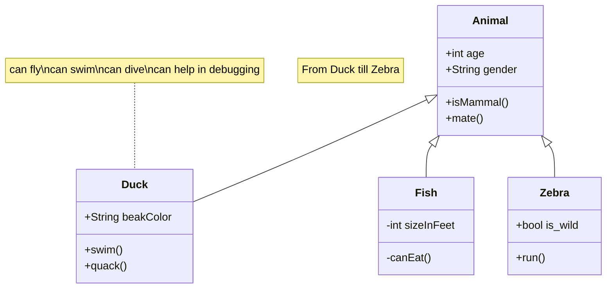
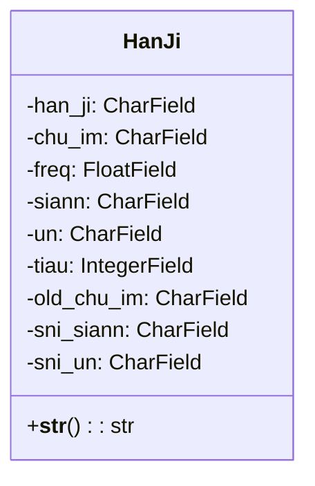

<!-- markdownlint-disable MD024 MD033 MD043 -->

# 漢字字典資料庫建置作業

系統中使用之「漢字字典」資料庫，將以自 CSV 文字檔匯入的方式來建置。

<mermaid/>



<mermaid/>



CSV 資料匯入的方法，基本有兩種：

1. 透過 Django Model ，將 CSV 資料匯入；
2. 將 CSV 資料直接匯入到 DB 中的 Table 中。

本專案採用方法 1。

::: tip
由於方法 2 得深入了解資料庫及其 SQL Script 的特性，否則，
資料雖能順利完成匯入，但在執行時期卻遇到無法讀出/寫入資料
的異常問題。
:::

## 作業程序

1. 進入專案根目錄。

   ```shell
   cd ~/worspace/rime/han_gi
   ```

2. 確認 SQLite 資料庫檔案，置於專案根目錄下。

   ```shell
   la db.sqlites
   ```

   ::: danger
   原有的資料庫檔案最後備份，以便遇有需要時可將資料庫回復到
   匯入前的狀態。

   ```shell
   cp db.sqlites db.sqlites.bak
   ```

   :::

3. 將 CSV 資料檔置於 **`tools`** 子目錄，檔案名稱為：**`han_ji.csv`** 。

4. 確認 CSV 資料檔已置入。

   ```shell
   la tools/han_ji.csv
   ```

5. 執行匯入程式。

   ```shell
   poetry run python tools/import_csv.py
   ```

## 漢字字典資料結構

### Data Model

```python
class HanJi(models.Model):
    han_ji = models.CharField(max_length=2)
    chu_im = models.CharField(max_length=10)
    freq = models.FloatField(null=True)
    siann = models.CharField(max_length=2)
    un = models.CharField(max_length=5)
    tiau = models.IntegerField()
    old_chu_im = models.CharField(max_length=10)
    sni_siann = models.CharField(max_length=10)
    sni_un = models.CharField(max_length=10)

    def __str__(self):
        return self.han_ji
```

### DB Table

```python
CREATE TABLE "han_ji_dict_hanji" (
 "id" integer NOT NULL,
 "han_ji" varchar(2) NOT NULL,
 "chu_im" varchar(10) NOT NULL,
 "freq" real,
 "siann" varchar(2) NOT NULL,
 "un" varchar(5) NOT NULL,
 "tiau" integer,
 "old_chu_im" varchar(10),
 "sni_siann" varchar(10) NOT NULL,
 "sni_un" varchar(10) NOT NULL,
 PRIMARY KEY("id" AUTOINCREMENT)
);
```

## Python 程式碼

```python
"""
Imports CSV data into the `han_ji_dict_hanji` table in SQLite.

Reads data from a CSV file named 'han_ji.csv' and inserts it into the
`han_ji_dict_hanji` table in the SQLite database 'db.sqlite3'.

Default values are set for the `freq` and `tiau` fields if they are empty
or invalid in the CSV file.

SQL Script to clear all data in `han_ji_dict_hanji` table:
DELETE FROM han_ji_dict_hanji;
"""

import csv
import sqlite3

# 建立連線
conn = sqlite3.connect('db.sqlite3')

# 讀取 CSV 檔案
with open('./tools/han_ji.csv', 'r', encoding='utf-8') as f:
    reader = csv.DictReader(f)

    # 將 CSV 資料匯入到資料庫表格中
    for row in reader:
        values = [
            row['id'],
            row['han_ji'],
            row['chu_im'],
            float(row['freq']) if row['freq'] else 0.0,  # Set default value for freq
            row['siann'],
            row['un'],
            int(row['tiau']) if row['tiau'] else 0,  # Set default value for tiau
            row['old_chu_im'],
            row['sni_siann'],
            row['sni_un'],
        ]
        conn.execute(
            'INSERT INTO han_ji_dict_hanji VALUES (?, ?, ?, ?, ?, ?, ?, ?, ?, ?)',
            values,
        )

    # 提交變更
    conn.commit()

# 關閉連線
conn.close()
```
