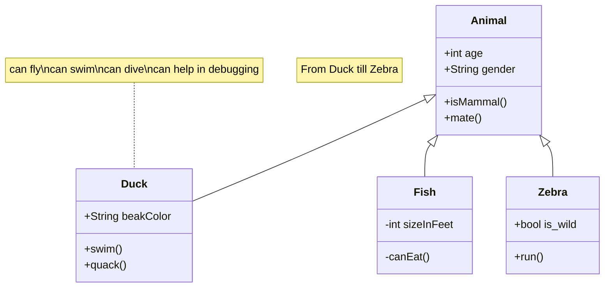
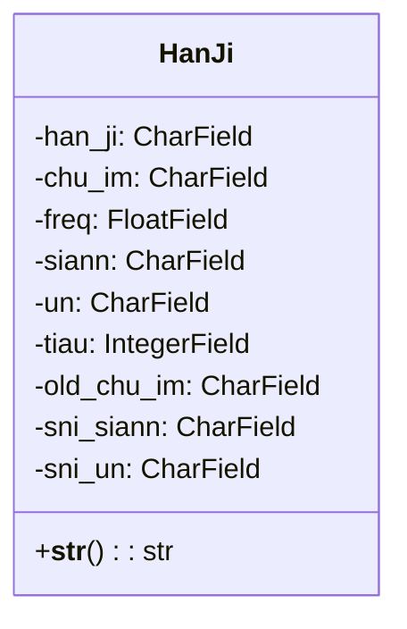

<!-- markdownlint-disable MD024 MD033 MD043 -->

# 漢字字典資料庫建置作業

系統中使用之「漢字字典」資料庫，將以自 CSV 文字檔匯入的方式
來建置。

<mermaid/>



<mermaid/>



CSV 資料匯入的方法，基本有兩種：

1. 透過 Django Model ，將 CSV 資料匯入；
2. 將 CSV 資料直接匯入到 DB 中的 Table 中。

本專案採用方法 1。

::: tip 由於方法 2 得深入了解資料庫及其 SQL Script 的特性，
否則，資料雖能順利完成匯入，但在執行時期卻遇到無法讀出/寫入
資料的異常問題。:::

## 作業程序

1. 進入專案根目錄。

   ```shell
   cd ~/worspace/rime/han_gi
   ```

2. 確認 SQLite 資料庫檔案，置於專案根目錄下。

   ```shell
   la db.sqlites
   ```

   ::: danger原有的資料庫檔案最後備份，以便遇有需要時可將資
   料庫回復到匯入前的狀態。

   ```shell
   cp db.sqlites db.sqlites.bak
   ```

   :::

3. 將 CSV 資料檔置於 **`tools`** 子目錄，檔案名稱
   為：**`han_ji.csv`** 。

4. 確認 CSV 資料檔已置入。

   ```shell
   la tools/han_ji.csv
   ```

5. 執行匯入程式。

   ```shell
   poetry run python tools/import_csv.py
   ```

## 漢字字典資料庫

### 建置 Ho-Lok-Ue 資料庫

```sh
-- Database: Ho-Lok-Ue

-- DROP DATABASE IF EXISTS "Ho-Lok-Ue";

CREATE DATABASE "Ho-Lok-Ue"
    WITH
    OWNER = root
    ENCODING = 'UTF8'
    LC_COLLATE = 'en_US.utf8'
    LC_CTYPE = 'en_US.utf8'
    LOCALE_PROVIDER = 'libc'
    TABLESPACE = pg_default
    CONNECTION LIMIT = -1
    IS_TEMPLATE = False;
```

### 建置 han_ji_dict 表格

漢字字典資料結構

```sh
CREATE TABLE han_ji_dict (
 id SERIAL PRIMARY KEY,
 han_ji varchar(2) NOT NULL,
 chu_im varchar(10) NOT NULL,
 freq real,
 siann varchar(3) NOT NULL,
 un varchar(10) NOT NULL,
 tiau integer,
 old_chu_im varchar(10),
 sni_siann varchar(10) NOT NULL,
 sni_un varchar(10) NOT NULL
);
```

## Python 工具箱

### 建置 Data Model

```python
class HanJi(models.Model):
    han_ji = models.CharField(max_length=2)
    chu_im = models.CharField(max_length=10)
    freq = models.FloatField(null=True)
    siann = models.CharField(max_length=3)
    un = models.CharField(max_length=10)
    tiau = models.IntegerField()
    old_chu_im = models.CharField(max_length=10)
    sni_siann = models.CharField(max_length=10)
    sni_un = models.CharField(max_length=10)

    def __str__(self):
        return self.han_ji
```

## 匯入 CSV 資料檔

以下程式碼，可將 CSV 資料檔，匯入 Ho-Lok-Ue 資料庫中的 han_ji_dict 表格。

```python
import csv
import psycopg2

# 建立連線到 PostgreSQL 資料庫
conn = psycopg2.connect(
    dbname="Ho-Lok-Ue",  # 資料庫名稱
    user="root",  # 用戶名
    password="changeme",  # 密碼
    host="localhost",  # 資料庫服務器地址，本地則為 localhost
)

# 建立 cursor 以執行資料庫操作
cur = conn.cursor()

# 讀取 CSV 檔案
with open("./tools/han_ji.csv", "r", encoding="utf-8") as f:
    reader = csv.DictReader(f)

    # 將 CSV 資料匯入到資料庫表格中
    for row in reader:
        values = (
            row["id"],
            row["han_ji"],
            row["chu_im"],
            float(row["freq"]) if row["freq"] else 0.0,  # Set default value for freq
            row["siann"],
            row["un"],
            int(row["tiau"]) if row["tiau"] else 0,  # Set default value for tiau
            row["old_chu_im"],
            row["sni_siann"],
            row["sni_un"],
        )
        cur.execute(
            "INSERT INTO han_ji_dict (id, han_ji, chu_im, freq, siann, un, tiau, old_chu_im, sni_siann, sni_un) VALUES (%s, %s, %s, %s, %s, %s, %s, %s, %s, %s)",
            values,
        )

    # 提交變更
    conn.commit()

# 關閉 cursor 和連線
cur.close()
conn.close()
```


### 重設漢字典表格

遇有特殊狀況，想將資料表格先刪除再重建，可使用以下之 Python 程式碼。

```python
import psycopg2

# 建立連線到 PostgreSQL 資料庫
conn = psycopg2.connect(
    dbname="Ho-Lok-Ue",  # 資料庫名稱
    user="root",  # 用戶名
    password="changeme",  # 密碼
    host="localhost",  # 資料庫服務器地址，本地則為 localhost
)

# 建立 cursor
cur = conn.cursor()

# 先刪除已存在的資料表，如果存在的話
cur.execute("DROP TABLE IF EXISTS public.han_ji_dict;")

# 建立新的資料表
cur.execute('''
    CREATE TABLE IF NOT EXISTS public.han_ji_dict
    (
        id SERIAL PRIMARY KEY,
        han_ji VARCHAR(2) NOT NULL,
        chu_im VARCHAR(10) NOT NULL,
        freq REAL,
        siann VARCHAR(3) NOT NULL,
        un VARCHAR(10) NOT NULL,
        tiau INTEGER,
        old_chu_im VARCHAR(10),
        sni_siann VARCHAR(10) NOT NULL,
        sni_un VARCHAR(10) NOT NULL
    );
''')

# 提交變更
conn.commit()

# 關閉 cursor 和連線
cur.close()
conn.close()
```