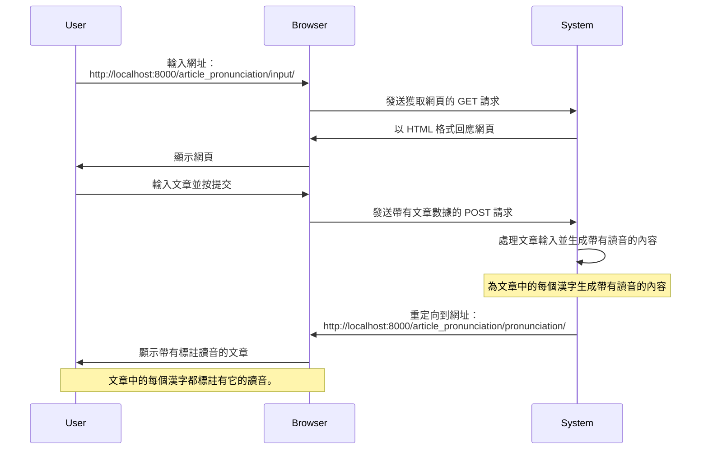
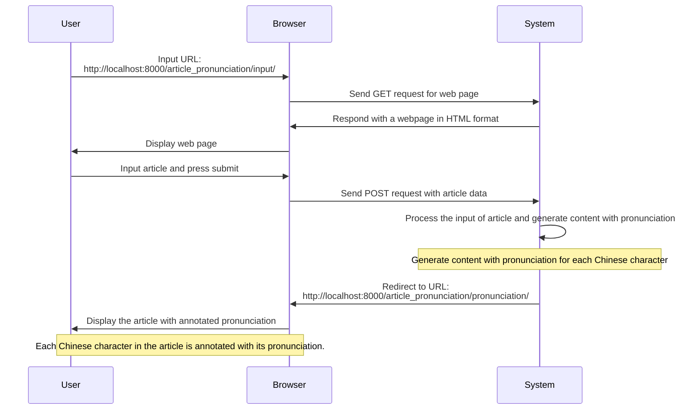
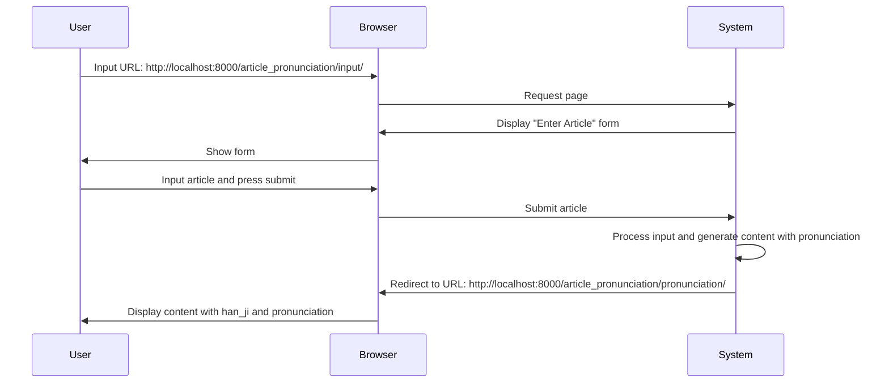

<!-- markdownlint-disable MD024 MD043 MD033 -->

# 《系統功能規格》

## 為文章標註漢語讀音

使用者可輸入一段「漢字」，或一篇文章。系統將為每個漢字標註「福建話音標」。

### 作業程序

1. 使用者在瀏覽器輸入網址。

   【網址】 <http://localhost:8000/article_pronunciation/pronunciation/>

2. 系統顯示「輸入文章」表單。

3. 使用者先在表單中輸入文章，然後按《提交》按鈕。

4. 系統處理輸入之文章，為每個漢字標註「福建話音標」。最後，向使用者顯示已標註福建話音標之文章。

   【網址】 <http://localhost:8000/article_pronunciation/pronunciation/>

### 作業示意圖

<mermaid/>



### 網頁架構

<mermaid/>

```mermaid
graph TD
    A(首頁)
    B(漢字字典)
    C(加註讀音)
    D(後台管理)

    A --> B
    A --> C
    linkStyle 0 stroke:#ff3,stroke-width:2px;
    Note over A,C: 漢字讀音，取自漢字字典
    A --> D
```

## Annotating Chinese Characters with Pronunciation in an Article

Users can input a string of "Chinese characters" or an entire article.
The system will annotate each Chinese character with the "Fujian dialect
phonetic notation."

### Procedure

1. The user enters the URL in the browser.

   【URL】 <http://localhost:8000/article_pronunciation/pronunciation/>

2. The system displays the "Enter Article" form.

3. The user inputs the article into the form and then clicks the "Submit" button.

4. The system processes the inputted article, annotates each Chinese
   character with the "Fujian dialect phonetic notation," and finally
   displays the article with annotated Fujian dialect phonetic notation to
   the user.

   【URL】 <http://localhost:8000/article_pronunciation/pronunciation/>

### Sqeuence Diagram for Procedure

<mermaid/>



## Reference: Original

- Step 1: User input URL in web browser `http://localhost:8000/article_pronunciation/input/`

- Step 2: System display `Enter Article` form

- Step 3: User input article into form and press submit button

- Step 4: System process the input and redirect to web page in URL and display the content
  which every han_ji (Chinese Character) with pronunction.
  (URL) <http://localhost:8000/article_pronunciation/pronunciation/>

Annotating Chinese Characters with Pronunciation in an Article
Users can input a string of "Chinese characters" or an entire article. The system will annotate each Chinese character with the "Fujian dialect phonetic notation."

Step 1: The user enters the URL in the browser.

【URL】 <http://localhost:8000/article_pronunciation/pronunciation/>

Step 2: The system displays the "Enter Article" form.

Step 3: The user inputs the article into the form and then clicks the "Submit" button.

Step 4: The system processes the inputted article, annotates each Chinese character with the "Fujian dialect phonetic notation," and finally displays the article with annotated Fujian dialect phonetic notation to the user.
【URL】 <http://localhost:8000/article_pronunciation/pronunciation/>

<mermaid/>


