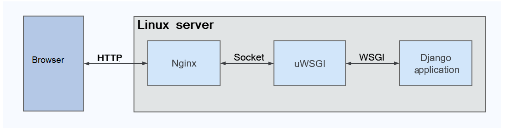
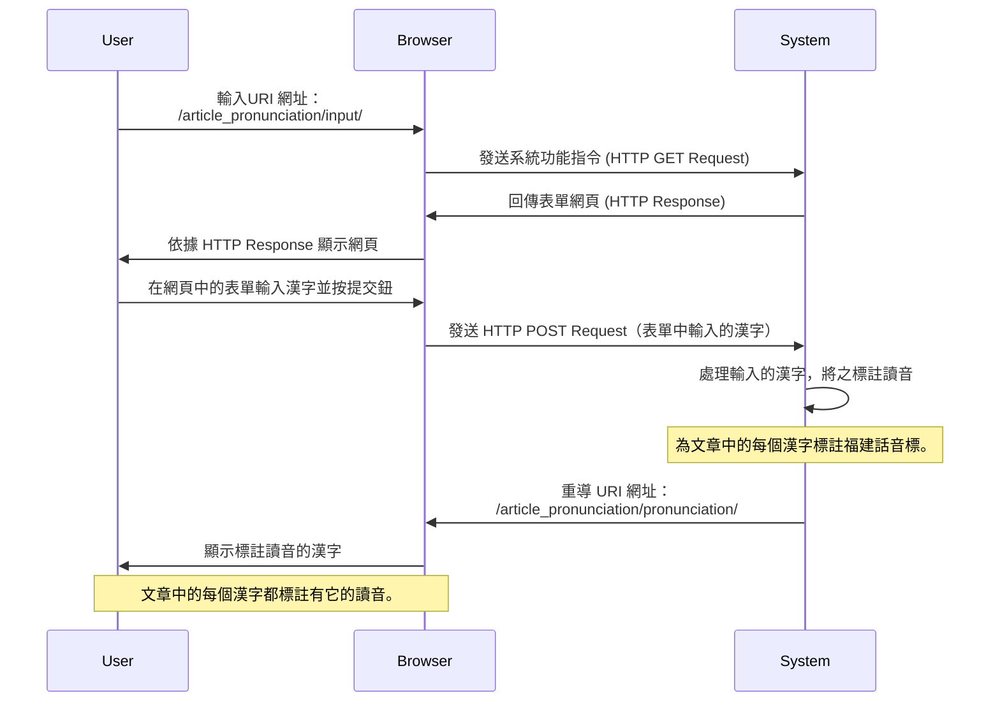

<!-- markdownlint-disable MD013 MD024 MD043 -->

# 系統維運作業指引

## 文件摘要

本操作手冊旨在指導電腦機房操作員，如何在實體電腦（伺服器）上
安裝及維護一個基於 Django 平台的應用系統。

文件主要架構：

- 文件摘要：說明應用系統的用途與主要功能；

- 執行環境：說明應用系統使用的「技術」，如 ：軟體以何種電腦
  語言開發、軟體須於何種「平台（Framework）」執行；

- 建置作業：指引機房管理員，拿到第一版的應用系統時，如何執行
  首次的「建置作業」，完成應用系統應用有的安裝及設定工作；

- 更新作業：指引機房管理員，當應用系統遇有更新時（可能時機：
  新增功能、修正軟體錯誤），如何執行新版軟體的更新作業。

## 執行環境

### 伺服器服務架構

本應用系統屬於「網路服務（Web Application）」類型，軟體使用
Python 電腦語言開發，須於 Django 平台（Framework）之上執行。

基於：執行效能及安全性之考量，應用系統之執行環境，尚需搭配
Nginx HTTP Server 和 uWSGI Server 以提供穩定的網路服務。

### 應用系統通訊作業流程

基於上述之伺服器服務架構，以下透過使用者（亦稱：Web Client）
的操作，其與應用系統間之互動程序，說明伺服器的各個服務，如何
協同運作：

1. Web Client 發送 HTTP Request；

2. HTTP 服務收到 HTTP Request 後，屬「靜態檔案」 (Static
   Files) 之請求，負責提供相關檔案予 Web Client 下載；或是將
   HTTP Request 打包成：「檔案類型」 之 Unix Socket ，然後轉
   交 APP 服務 (uWSGI) 處理；

3. APP 服務自檔案讀取 Unix Socket 內容，並轉發予 Django 應用
   系統處理此發自 Web Client 端之 HTTP Request。

<mermaid/>

### 運行作業環境規格

以下是應用系統運行所需的技術和環境要求：

- 開發語言：Python
- 平台（Framework）：Django
- HTTP Server：Nginx
- WSGI Server：Gunicorn

對於 Python 在應用及管理的要求如下：

- 直譯器版本：3.10.6
- 直譯器版本管理工具：pyenv
- 套件（Package）管理工具：Poetry
- 虛擬環境（VirtualEnv）管理工具：Python 內建的 venv 套件
- 虛擬環境使用之目錄：位於 Django 專案根目錄下，目錄名為
  .venv。

應用系統之安裝、更新，務必檢查，確認工作之執行，遵循以上要求
完成。在伺服器執行建置、更新作業時，務必遵循本指引相關作業章
節，依照作業程序逐步執行，以確保應用系統能正確運行。

## 作業程序

- [建置作業程序](./d510_Build_Server.md)
- [更新作業程序](./d520_Update.md)

## 參考文件

- [How to use Django with uWSGI](https://docs.djangoproject.com/en/4.2/howto/deployment/wsgi/uwsgi/)
  : Django 官網提供之文件，說明 Django 應用系統如何與 uWSGI
  整合；

- [uWSGI 官網文件](https://uwsgi-docs.readthedocs.io/en/latest/)

  - [Installing uWSGI](https://uwsgi-docs.readthedocs.io/en/latest/Install.html)
  - [Setting up Django and your web server with uWSGI and nginx](https://uwsgi.readthedocs.io/en/latest/tutorials/Django_and_nginx.html)

## 名詞解釋

- WSGI: Web Server Gateway Interface. WSGI is a Python
  standard.

A web server faces the outside world. It can serve files
(HTML, images, CSS, etc) directly from the file system.
However, it can’t talk directly to Django applications; it
needs something that will run the application, feed it
requests from web clients (such as browsers) and return
responses.

A Web Server Gateway Interface - WSGI - does this job. WSGI
is a Python standard.

uWSGI is a WSGI implementation. In this tutorial we will set
up uWSGI so that it creates a Unix socket, and serves
responses to the web server via the uwsgi protocol. At the
end, our complete stack of components will look like this:

    the web client <-> the web server <-> the socket <-> uwsgi <-> Django

Web 伺服器（或稱 HTTP 服務）負責與外界連繫。當外界欲提取檔案
時（如：HTML 網頁、圖像、CSS 等），可由 Web 伺服器負責完成。
然而，它不能直接與 Django 應用系統對話。

當 Web 用戶端（如：瀏覽器）發出的請求（request），需要
Django 應用系統進行處理，然後回應（Response）時，則需要一個
中介軟體；由此中介軟體即所謂之：WSGI。

WSGI 的用途在於：自 Web 伺服器接收來自 Web 用戶端的請求；然
後轉交予 Django 應用系統處理；最後將 Django 應用系統處理的結
果回應予 Web 用戶端。

WSGI 是 Ptyhon Web 的標準，故 Django 應用系統需藉此標準與
Web 伺服器串接整合。而 uWSGI 則是一個依據 WSGI 標準實作之軟
體。
