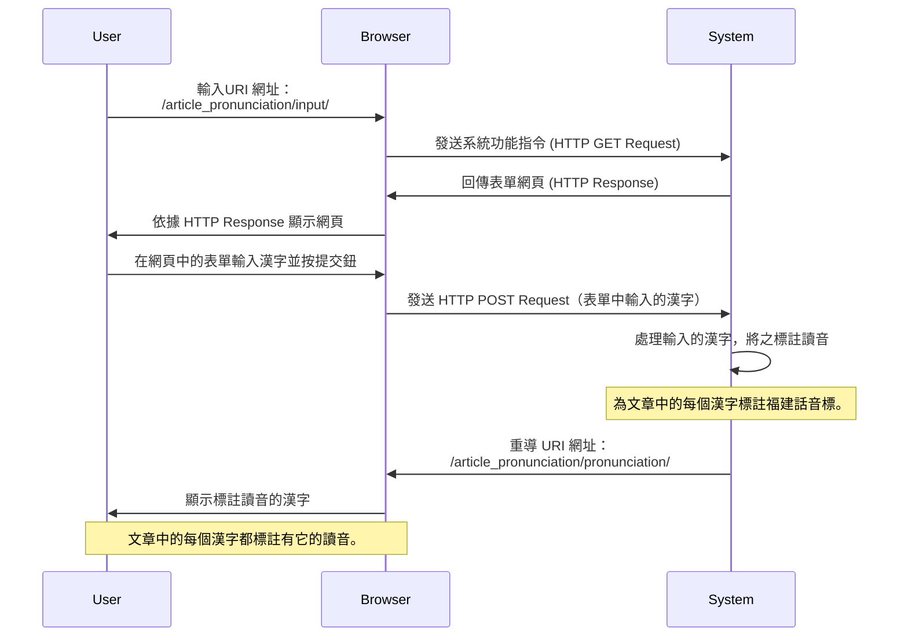

<!-- markdownlint-disable MD013 MD024 MD043 -->

# 系統維運作業指引

## 文件摘要

本操作手冊旨在指導電腦機房操作員，如何在實體電腦（伺服器）上
安裝及維護一個基於 Django 平台的應用系統。

文件主要架構：

- 文件摘要：說明應用系統的用途與主要功能；

- 執行環境：說明應用系統使用的「技術」，如 ：軟體以何種電腦
  語言開發、軟體須於何種「平台（Framework）」執行；

- 建置作業：指引機房管理員，拿到第一版的應用系統時，如何執行
  首次的「建置作業」，完成應用系統應用有的安裝及設定工作；

- 更新作業：指引機房管理員，當應用系統遇有更新時（可能時機：
  新增功能、修正軟體錯誤），如何執行新版軟體的更新作業。

## 執行環境

### 伺服器服務架構

本應用系統屬於「網路服務（Web Application）」類型，軟體使用
Python 電腦語言開發，須於 Django 平台（Framework）之上執行。

基於：執行效能及安全性之考量，應用系統之執行環境，尚需搭配
Nginx HTTP Server 和 uWSGI Server 以提供穩定的網路服務。

### 應用系統通訊作業流程

基於上述之伺服器服務架構，以下透過使用者（亦稱：Web Client）
的操作，其與應用系統間之互動程序，說明伺服器的各個服務，如何
協同運作：

1. Web Client 發送 HTTP Request；

2. HTTP 服務收到 HTTP Request 後，屬「靜態檔案」 (Static
   Files) 之請求，負責提供相關檔案予 Web Client 下載；或是將
   HTTP Request 打包成：「檔案類型」 之 Unix Socket ，然後轉
   交 APP 服務 (uWSGI) 處理；

3. APP 服務自檔案讀取 Unix Socket 內容，並轉發予 Django 應用
   系統處理此發自 Web Client 端之 HTTP Request。

<mermaid/>

### 運行作業環境規格

以下是應用系統運行所需的技術和環境要求：

- 開發語言：Python
- 平台（Framework）：Django
- HTTP Server：Nginx
- WSGI Server：Gunicorn

對於 Python 在應用及管理的要求如下：

- 直譯器版本：3.10.6
- 直譯器版本管理工具：pyenv
- 套件（Package）管理工具：Poetry
- 虛擬環境（VirtualEnv）管理工具：Python 內建的 venv 套件
- 虛擬環境使用之目錄：位於 Django 專案根目錄下，目錄名為
  .venv。

應用系統之安裝、更新，務必檢查，確認工作之執行，遵循以上要求
完成。在伺服器執行建置、更新作業時，務必遵循本指引相關作業章
節，依照作業程序逐步執行，以確保應用系統能正確運行。

## [建置作業](./Build_Server.md)

1. 確保已安裝 Python 和 Django：應用系統需運行在 Python 環境
   下，請確保已在伺服器上安裝 Python (版本 3.6 或以上) 以及
   相應的 Django (版本 2.2 或以上)。若尚未安裝，請依照
   Python 官方網站和 Django 官方網站的說明進行安裝。

2. 取得應用系統原始碼：從版本控制系統（如 Git）中取得應用系
   統的原始碼，並將其放置在伺服器上的適當目錄中。

3. 設定環境變數：根據應用系統的需求，設定相應的環境變數，如
   資料庫連接資訊、應用系統的執行模式等。

4. 安裝相依套件：在伺服器上執行 pip install -r
   requirements.txt 命令，以安裝應用系統所需的相依套件。

5. 初始化資料庫：執行 python manage.py migrate 命令，以初始
   化資料庫並建立相應的資料表結構。

6. 啟動應用系統：執行 python manage.py runserver 命令，啟動
   應用系統。若需將應用系統綁定至特定 IP 和埠號，可在命令後
   加上相應參數，如 python manage.py runserver
   192.168.1.100:8000。

7. 安裝並設定 Nginx：應用系統使用 Nginx 作為 HTTP 伺服器，以
   強化靜態檔案處理能力，並提供使用者更快速的下載體驗。請依
   照 Nginx 官方網站的說明進行安裝。安裝完成後，請修改 Nginx
   的設定檔，將靜態檔案路徑設定為應用系統的靜態檔案目錄，並
   將 HTTP 請求代理至 Gunicorn 伺服器。

8. 安裝並設定 Gunicorn：應用系統使用 Gunicorn 作為 WSGI HTTP
   伺服器，用以將 Nginx 收到的 HTTP 請求轉交給 Django 應用系
   統進行後續處理。請執行 pip install gunicorn 命令以安裝
   Gunicorn，然後編寫一個 Gunicorn 設定檔，指定應用系統的
   WSGI 模組及運行參數。

9. 啟動 Nginx 和 Gunicorn：分別使用適當的命令啟動 Nginx 和
   Gunicorn。例如，對於 Gunicorn，您可以使用類似於以下的命令
   ：gunicorn -c gunicorn.conf.py
   your_project.wsgi:application。對於 Nginx，您可以使用類似
   於 sudo service nginx start 的命令啟動。

## 更新作業

1. 停止應用系統：在伺服器上執行 Ctrl + C 命令，停止正在運行
   的應用系統。

2. 獲取更新後的原始碼：從版本控制系統（如 Git）中獲取更新後
   的應用系統原始碼，並覆蓋伺服器上的

3. 更新相依套件：如有必要，請執行 pip install -r
   requirements.txt 命令，以更新應用系統所需的相依套件。

4. 更新資料庫結構：如有資料庫結構變動，請執行 python
   manage.py migrate 命令，以更新資料庫結構。

5. 重新啟動應用系統：分別重啟 Nginx 和 Gunicorn 伺服器，使更
   新後的應用系統生效。例如，對於 Gunicorn，您可以使用類似於
   以下的命令：gunicorn -c gunicorn.conf.py
   your_project.wsgi:application。對於 Nginx，您可以使用類似
   於 sudo service nginx restart 的命令重啟。
