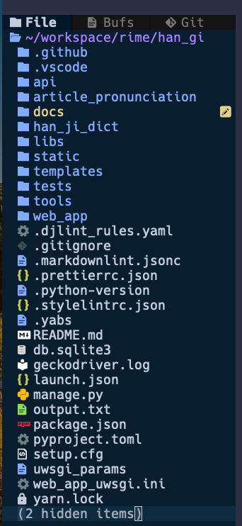
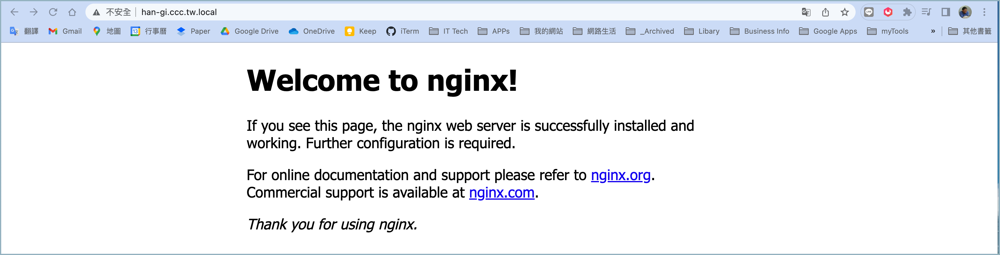

<!-- markdownlint-disable MD024 MD043 MD029 MD040 -->

# 建置作業程序

## 摘要

首次建置應用系統所需之執行平台時，應循本作業程序，完成應用系
統應用有之安裝及設定工作。

## 作業流程

- 安裝應用系統作業平台
- 安裝應用系統作業
- 安裝 HTTP 服務作業
- 安裝 WSGI 服務作業

## 設定 Hostname 與 IP 對照表

在 Host 清單（檔案：/etc/hosts），建置 Django 應用系統之
Host Name 及使 用之 IP 。

1. 編輯 Host 清單。

```sh
sudoedit /etc/hosts
```

2. 添加一筆 Host 與 IP 對映紀錄。

```sh
127.0.0.1       localhost
127.0.0.1       SRV-2020
192.168.66.10   app.ccc.tw.local
192.168.66.20   hangi.ccc.tw.local
```

## 安裝應用系統作業平台

設定 Python 作業環境。

- 安裝 Ubuntu Server （使用 Ubuntu Desktop 22.04）
- 安裝 pyenv
- 安裝 poetry

### 安裝 pyenv

[pyenv github 官網](https://github.com/pyenv/pyenv)

1. 安裝 pyenv

```sh
curl https://pyenv.run | bash
```

2. 設定 Shell

```sh
#--------------------------------------------------------------------
# pyenv
#--------------------------------------------------------------------
# export PYENV_ROOT=$(pyenv root)
export PYENV_ROOT="$HOME/.pyenv"
export PATH="$PYENV_ROOT/bin:$PATH"
if command -v pyenv 1>/dev/null 2>&1; then
 eval "$(pyenv init --path)"
 eval "$(pyenv init -)"
fi
export PYENV_VIRTUALENV_DISABLE_PROMPT=1
```

3. 重啟 Shell

```sh
exec $SHELL
```

### 安裝 python

```sh
pyenv install 3.10.6
```

### 安裝 poetry

[Python Poetry 官網](https://python-poetry.org/)

1. 安裝 poetry 套件

```sh
curl -sSL https://install.python-poetry.org | python3 -
```

2. 驗證安裝結果。

```sh
ll ~/.local/share/pypoetry
```

3. 設定 SHELL 環境

```sh
export PATH="$HOME/.local/bin:$PATH"
```

4. 重啟 SHELL

```sh
exec $SHELL
```

5. 驗證安裝及設定結果。

```sh
poetry --version

poetry self update
```

## 安裝應用系統

### 應用系統目錄結構



### 建置目錄及設定使用權限

1. 建置應用系統安裝目錄。

```sh
❯ sudo mkdir /apps && cd $_

❯ sudo chown -R alanjui:www-data /apps

❯ ll /apps
總用量 12
drwxrwxr-x  3 www-data www-data 4096  3月 26 20:29 ./
drwxr-xr-x 22 root     root     4096  3月 26 20:23 ../
drwxrwxr-x 14 alanjui  www-data 4096  3月 26 20:30 hangi.ccc.tw.local
```

2. 將系統管理員用戶帳號加入 www-data 群組。

```sh
❯ sudo usermod -a -G www-data alanjui

❯ id alanjui
uid=1000(alanjui) gid=1000(alanjui) groups=1000(alanjui),4(adm),24(cdrom),27(sudo),30(dip),33(www-data),46(plugdev),109(kvm),122(lpadmin),134(lxd),135(sambashare),138(libvirt)
```

3. 用戶帳號登出；再登入。

務必執行此步驟，否則已付予 www-data 群組，在目錄及檔案之使用
權限，將無法正常運作。

### 安裝作業程序步驟

1. 進入應用系統安裝目錄

```sh
cd /apps
```

2. 自 Git Repo 下載原始碼

```sh
git clone git@github.com:AlanJui/Django4-Project-Template.git hangi.ccc.tw.local
cd hangi.ccc.tw.local
```

3. 建置 Python 虛擬環境

```sh
❯ pyenv version
3.10.6 (set by /apps/hangi.ccc.tw.local/.python-version)

❯ python -m venv .venv
❯ ll .venv
總用量 24
drwxrwxr-x  5 alanjui alanjui 4096  7月 18 12:38 ./
drwxrwxr-x 16 alanjui alanjui 4096  7月 18 12:38 ../
drwxrwxr-x  2 alanjui alanjui 4096  7月 18 12:38 bin/
drwxrwxr-x  2 alanjui alanjui 4096  7月 18 12:38 include/
drwxrwxr-x  3 alanjui alanjui 4096  7月 18 12:38 lib/
lrwxrwxrwx  1 alanjui alanjui    3  7月 18 12:38 lib64 -> lib/
-rw-rw-r--  1 alanjui alanjui  102  7月 18 12:38 pyvenv.cfg
```

4. 安裝應用系統所需使用之 Python 套件。

```sh
❯ poetry shell
Spawning shell within /apps/hangi.ccc.tw.local/.venv
❯ emulate bash -c '. /apps/hangi.ccc.tw.local/.venv/bin/activate'

❯ poetry install
```

5. 組建應用系統。

```sh
python manage.py migrate
python manage.py collectstatic
```

6. 建立應用系統之「後台管理員」。

```sh
python manage.py createsuperuser
```

### 驗證安裝作業成功

1. 啟動 Django Web Server。

```sh
python manage.py runserver 0.0.0.0:8000
```

2. 在瀏覽器輸入以下網址，以此方式驗 證 Django 應用系統在
   Debug 模式，已能正常運作。

```
http://127.0.0.1:8000/
```

### 驗證 Hostname 亦能連線

1. 編輯 /etc/hosts

```sh
192.168.66.20   hangi.ccc.tw.local
```

2. 啟動 Django Web Server。

```sh
python manage.py runserver 0.0.0.0:8000
```

3. 在瀏覽器輸入以下網址，驗證 Hostname 已能正常運作。

```sh
http://hangi.ccc.tw.local:8000/
```

## 安裝 HTTP 服務

### 安裝 nginx 套件

安裝 nginx 作為 HTTP Server

1. 安裝 nginx 套件。

```sh
sudo apt install nginx -y
```

2. 驗證 nginx 服務已完成安裝，且被正常啟動。

檢驗服務已被啟動，且能隨作業系統開機，自行啟動；

```sh
systemctl status nginx
```

📺 查詢 nginx 執行狀態：

```sh
alanjui@VB02-Ubuntu-2004:~$ systemctl status nginx
● nginx.service - A high performance web server and a reverse proxy server
     Loaded: loaded (/lib/systemd/system/nginx.service; enabled; vendor preset: enabled)
     Active: active (running) since Fri 2021-03-26 14:30:00 CST; 1min 10s ago
       Docs: man:nginx(8)
   Main PID: 67493 (nginx)
      Tasks: 3 (limit: 4653)
     Memory: 4.8M
     CGroup: /system.slice/nginx.service
             ├─67493 nginx: master process /usr/sbin/nginx -g daemon on; master_process on;
             ├─67494 nginx: worker process
             └─67495 nginx: worker process

 3月 26 14:30:00 VB02-Ubuntu-2004 systemd[1]: Starting A high performance web server and a reverse proxy ser>
 3月 26 14:30:00 VB02-Ubuntu-2004 systemd[1]: Started A high performance web server and a reverse proxy serv>
lines 1-14/14 (END)
```

3. 檢驗 Web Client 端，已能連上由 nginx 服務建構而成之 HTTP
   Server 。

   使用 Web 瀏覽器，瀏覽如下網址，若能正常閱讀「網頁」內容，
   則表 HTTP Server 已能 正常運作。

```sh
http://hangi.ccc.tw.local/
```



### 建置 HTTP 虛擬網站

建置 HTTP 虛擬網站，供 Django 應用系統，處理 static 型態檔案
。

1. 建置 Nginx 虛擬網站設定檔。

```sh
cd /etc/nginx/site-available
sudo cp default hangi.ccc.tw.local
sudoedit hangi.ccc.tw.local
```

/etc/nginx/sites-available/hangi.ccc.tw.local:

```sh
upstream django_hangi {
    # server 127.0.0.1:8001;
    server unix:///apps/hangi.ccc.tw.local/web_app.sock;
}

server {
    listen 80;

    server_name             hangi.ccc.tw.local;
    charset                 utf-8;

    # max upload size
    client_max_body_size    75M;

    # Django media
    location /media {
        alias        /apps/hangi.ccc.tw.local/media;
    }

    location /static {
        alias        /apps/hangi.ccc.tw.local/static_collected;
    }

    location / {
        uwsgi_pass   django_hangi;
        include      /apps/hangi.ccc.tw.local/uwsgi_params;
    }

    access_log      /var/log/nginx/hangi.ccc.tw.local.log;
    error_log       /var/log/nginx/hangi.ccc.tw.local.error.log;
}
```

2. 檢測設定檔，確認內容無誤。

```sh
❯ sudo nginx -t
nginx: the configuration file /etc/nginx/nginx.conf syntax is ok
nginx: configuration file /etc/nginx/nginx.conf test is successful
```

### 目錄及檔案權限設定

```sh
sudo chown -R root:www-data /etc/nginx/sites-available
sudo chown -R root:www-data /etc/nginx/sites-enable

❯ ll /etc/nginx
總用量 80
drwxr-xr-x   8 root root      4096  7月 18 15:08 ./
drwxr-xr-x 145 root root     12288  7月 20 11:01 ../
drwxr-xr-x   2 root root      4096  5月 31 01:31 conf.d/
-rw-r--r--   1 root root      1125  5月 31 01:31 fastcgi.conf
-rw-r--r--   1 root root      1055  5月 31 01:31 fastcgi_params
-rw-r--r--   1 root root      2837  5月 31 01:31 koi-utf
-rw-r--r--   1 root root      2223  5月 31 01:31 koi-win
-rw-r--r--   1 root root      3957  5月 31 01:31 mime.types
drwxr-xr-x   2 root root      4096  5月 31 01:31 modules-available/
drwxr-xr-x   2 root root      4096  7月 18 15:08 modules-enabled/
-rw-r--r--   1 root root      1447  5月 31 01:31 nginx.conf
-rw-r--r--   1 root root       180  5月 31 01:31 proxy_params
-rw-r--r--   1 root root       636  5月 31 01:31 scgi_params
drwxr-xr-x   2 root www-data  4096  7月 19 23:28 sites-available/
drwxr-xr-x   2 root www-data  4096  7月 19 23:14 sites-enabled/
drwxr-xr-x   2 root root      4096  7月 18 15:08 snippets/
-rw-r--r--   1 root root       664  5月 31 01:31 uwsgi_params
-rw-r--r--   1 root root      3071  5月 31 01:31 win-utf
```

```sh
sudo chown -R alanjui:www-data /apps/hangi.ccc.tw.local

❯ ll /apps/hangi.ccc.tw.local
總用量 2992
drwxrwxr-x 17 alanjui www-data    4096  7月 20 11:08 ./
drwxrwxr-x  4 root    www-data    4096  7月 19 22:38 ../
drwxrwxr-x  5 alanjui www-data    4096  7月 18 12:43 api/
drwxrwxr-x  7 alanjui www-data    4096  7月 20 10:19 article_pronunciation/
-rw-rw-r--  1 alanjui www-data 1036288  7月 18 12:44 db.sqlite3
-rw-rw-r--  1 alanjui www-data    1244  7月 18 12:32 .djlint_rules.yaml
drwxrwxr-x 13 alanjui www-data    4096  7月 18 12:32 docs/
-rw-rw-r--  1 alanjui www-data    9202  7月 18 12:32 geckodriver.log
drwxrwxr-x  8 alanjui www-data    4096  7月 20 10:50 .git/
drwxrwxr-x  3 alanjui www-data    4096  7月 18 12:32 .github/
-rw-rw-r--  1 alanjui www-data     407  7月 18 12:32 .gitignore
drwxrwxr-x  6 alanjui www-data    4096  7月 18 12:43 han_ji_dict/
-rw-rw-r--  1 alanjui www-data    1284  7月 18 12:32 launch.json
drwxrwxr-x  2 alanjui www-data    4096  7月 18 12:32 libs/
-rwxrwxr-x  1 alanjui www-data     663  7月 18 12:32 manage.py*
-rw-rw-r--  1 alanjui www-data    7734  7月 18 12:32 .markdownlint.jsonc
-rw-rw-r--  1 alanjui www-data      96  7月 18 12:32 output.txt
-rwxrwxr-x  1 alanjui www-data    1143  7月 18 12:32 package.json*
-rw-rw-r--  1 alanjui www-data 1239565  7月 18 12:32 package-lock.json
-rw-rw-r--  1 alanjui www-data  220192  7月 20 10:11 poetry.lock
-rw-rw-r--  1 alanjui www-data     755  7月 18 12:32 .prettierrc.json
-rw-rw-r--  1 alanjui www-data    5447  7月 20 10:11 pyproject.toml
-rw-rw-r--  1 alanjui www-data       7  7月 18 12:32 .python-version
-rw-rw-r--  1 alanjui www-data   18157  7月 18 12:32 README.md
-rw-rw-r--  1 alanjui www-data    1057  7月 18 12:32 setup.cfg
drwxrwxr-x  4 alanjui www-data    4096  7月 18 12:32 static/
drwxrwxr-x  8 alanjui www-data    4096  7月 18 12:44 static_collected/
-rw-rw-r--  1 alanjui www-data     162  7月 18 12:32 .stylelintrc.json
drwxrwxr-x  2 alanjui www-data    4096  7月 18 12:32 templates/
-rw-rw-r--  1 alanjui www-data     149  7月 19 22:56 test.py
drwxrwxr-x  6 alanjui www-data    4096  7月 18 12:32 tests/
drwxrwxr-x  2 alanjui www-data    4096  7月 18 12:32 tools/
-rw-rw-r--  1 alanjui www-data     664  7月 19 12:29 uwsgi_params
drwxrwxr-x  6 alanjui alanjui     4096  7月 20 10:15 .venv/
drwxrwxr-x  2 alanjui www-data    4096  7月 18 12:32 .vscode/
drwxrwxr-x  3 alanjui www-data    4096  7月 20 10:56 web_app/
-rw-rw-r--  1 alanjui www-data     546  7月 20 10:08 web_app_uwsgi.ini
-rw-rw-r--  1 alanjui www-data    3613  7月 18 12:32 .yabs
-rw-rw-r--  1 alanjui www-data  386745  7月 18 12:32 yarn.lock
```

### 啟用 HTTP 虛擬網站

1. 建立啟用 nginx 虛擬網站之 symlink 。

```sh
sudo ln -fns /etc/nginx/sites-available/hangi.ccc.tw.local /etc/nginx/sites-enable
```

2. 重啟 nginx 服務。

```sh
sudo systemctl restart nginx
sudo systemctl status nginx
```

【無法正常重啟 nginx 案例】：

```sh
❯ sudo systemctl restart nginx
Job for nginx.service failed because the control process exited with error code.
See "systemctl status nginx.service" and "journalctl -xeu nginx.service" for details.
```

### 驗證 HTTP 虛擬網站已能運作

在 Web 用戶端，透過「瀏覽器」發送 HTTP Request，要求瀏覽某靜
態檔案（如：.html / .css / .jpg / .png / ...），若瀏覽器能顯
示該靜態檔案的內容，即代表 Nginx 所建置的「虛擬網站」，已能
正常作業，對於 HTTP Request 要求，能提供相對映，應有之 HTTP
Response 。

在瀏覽器輸入以下網址，要求瀏覽 style.css 靜態檔。

```sh
http://hangi.ccc.tw.local/static/admin/css/base.css
```

【實體檔案路徑】：

```sh
❯ ll /apps/hangi.ccc.tw.local/static_collected/admin/css/base.css
-rw-r--r-- 1 alanjui www-data 20344  7月 19 22:41 /apps/hangi.ccc.tw.local/static_collected/admin/css/base.css
```

## 安裝 WSGI 服務

### 建置 uWSGI 介面設定檔

WSGI 是 Python Web 應用系統介面，當 Web 伺服器遇有無法處理的
HTTP Request ，將之轉換為 web sock 轉予 Django Application
處理。

此步驟之目的，在於檢驗 Web 伺服器，可將 Web 用戶端傳來之
HTTP Request ，打包成 Web Socket ，供 uWSGI 軟體轉交 Django
Application 處理。

```sh
web client <-> web server <-> unix socket <-> uWSGI <-> Python
                (Nginx)                      (uwsgi)   (Django)
```

1. 透過 poetry 套件管理工具，安裝 python 套件：uwsgi 。

```sh
poetry add uwsgi
```

【註】：套件安裝檢驗

```sh
uwsgi --socket web_app.sock --wsgi-file test.py --chmod-socket=666
```

2. 變更 nginx 虛擬網站設定檔，改用 Web Socket。

【/etc/nginx/site-available/hangi.ccc.tw.local】：

```sh
upstream django_hangi {
    # server 127.0.0.1:8001;
    server unix:///apps/hangi.ccc.tw.local/web_app.sock;
}
......
```

3. 複製 nginx 所提供的 uwsgi 設定檔：uwsi_params

```sh
sudo cp /etc/nginx/uwsgi_params .
chown alanjui:www-data uwsgi_params
```

4. 建置 uwsgi 用設定檔：web_app_uwsgi.ini 。

`/apps/hangi.ccc.tw.local/web_app_uwsgi.ini`：

```sh
[uwsgi]
# Django-related settings
# the base direc
chdir               = /apps/hangi.ccc.tw.local
# Django's wsgi file
module              = web_app.wsgi
# the virtualenv
home                = /apps/hangi.ccc.tw.local/.venv/
# process-related settings
# master
master              = true
# maximum number of worker processes
processes           = 10
# the socket
socket              = /apps/hangi.ccc.tw.local/web_app.sock
# ... with appropriate permissions
chmod-socket        = 666
# clear environment on exit
vacuum              = true
```

### 驗證 WSGI 服務已與應用系統整合

驗證 Nginx + uWSGI + Django App 已完成整合。

1. 執行 uwsgi 。

```sh
poetry run uwsgi --ini web_app_uwsgi.ini
```

2. 透過瀏覽器，驗證 HTTP Request 已能循下列路徑運作： nginx
   <--> uwsgi <--> Django App 。

   在瀏覽器輸入以下網址：

```sh
http://hangi.ccc.tw.local/
http://hangi.ccc.tw.local/static/admin/css/base.css
```

### 設定 WSGI 服務自動啟動

為使已佈署之 Django 應用系統，能於開機後自動啟動。故需建置及
啟用 Django 應用系統專用之服務。

1. 建置 hangi 服務設定檔。

```sh
sudoedit /etc/systemd/system/hangi.service
```

【檔案內容】：

```sh
[Unit]
Description=uWSGI instance to serve hangi.ccc.tw.local

[Service]
ExecStartPre=-/usr/bin/bash -c 'mkdir -p /run/uwsgi; chown www-data:www-data /run/uwsgi'
ExecStart=/usr/bin/bash -c 'cd /apps/hangi.ccc.tw.local; \
.venv/bin/uwsgi --ini web_app_uwsgi.ini'

[Install]
WantedBy=multi-user.target
```

2. 啟用 hangi 服務。

```sh
❯ sudo systemctl enable hangi
Created symlink /etc/systemd/system/multi-user.target.wants/hangi.service → /etc/systemd/system/hangi.service.

❯ sudo systemctl start hangi
```

3. 檢視 hangi 服務，確認該服務已能正常運作。

```sh
❯ sudo systemctl status hangi
● hangi.service - uWSGI instance to serve hangi.ccc.tw.local
     Loaded: loaded (/etc/systemd/system/hangi.service; enabled; vendor preset: enabled)
     Active: active (running) since Thu 2023-07-20 12:14:32 CST; 1min 7s ago
    Process: 17680 ExecStartPre=/usr/bin/bash -c mkdir -p /run/uwsgi; chown www-data:www-data /run/uwsgi (code=exited,>
   Main PID: 17682 (uwsgi)
      Tasks: 11 (limit: 18976)
     Memory: 35.7M
        CPU: 336ms
     CGroup: /system.slice/hangi.service
             ├─17682 .venv/bin/uwsgi --ini web_app_uwsgi.ini
             ├─17751 .venv/bin/uwsgi --ini web_app_uwsgi.ini
             ├─17752 .venv/bin/uwsgi --ini web_app_uwsgi.ini
             ├─17753 .venv/bin/uwsgi --ini web_app_uwsgi.ini
             ├─17754 .venv/bin/uwsgi --ini web_app_uwsgi.ini
             ├─17755 .venv/bin/uwsgi --ini web_app_uwsgi.ini
             ├─17756 .venv/bin/uwsgi --ini web_app_uwsgi.ini
             ├─17757 .venv/bin/uwsgi --ini web_app_uwsgi.ini
             ├─17758 .venv/bin/uwsgi --ini web_app_uwsgi.ini
             ├─17759 .venv/bin/uwsgi --ini web_app_uwsgi.ini
             └─17760 .venv/bin/uwsgi --ini web_app_uwsgi.ini

 7月 20 12:14:33 mbp-2012 bash[17682]: spawned uWSGI worker 1 (pid: 17751, cores: 1)
 7月 20 12:14:33 mbp-2012 bash[17682]: spawned uWSGI worker 2 (pid: 17752, cores: 1)
 7月 20 12:14:33 mbp-2012 bash[17682]: spawned uWSGI worker 3 (pid: 17753, cores: 1)
 7月 20 12:14:33 mbp-2012 bash[17682]: spawned uWSGI worker 4 (pid: 17754, cores: 1)
 7月 20 12:14:33 mbp-2012 bash[17682]: spawned uWSGI worker 5 (pid: 17755, cores: 1)
 7月 20 12:14:33 mbp-2012 bash[17682]: spawned uWSGI worker 6 (pid: 17756, cores: 1)
 7月 20 12:14:33 mbp-2012 bash[17682]: spawned uWSGI worker 7 (pid: 17757, cores: 1)
 7月 20 12:14:33 mbp-2012 bash[17682]: spawned uWSGI worker 8 (pid: 17758, cores: 1)
 7月 20 12:14:33 mbp-2012 bash[17682]: spawned uWSGI worker 9 (pid: 17759, cores: 1)
 7月 20 12:14:33 mbp-2012 bash[17682]: spawned uWSGI worker 10 (pid: 17760, cores: 1)
lines 1-31/31 (END)
```

## 參考資料

- [Setting up Django and your web server with uWSGI and nginx](https://uwsgi-docs.readthedocs.io/en/latest/tutorials/Django_and_nginx.html)
