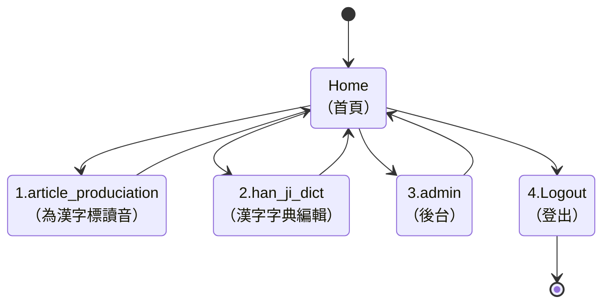
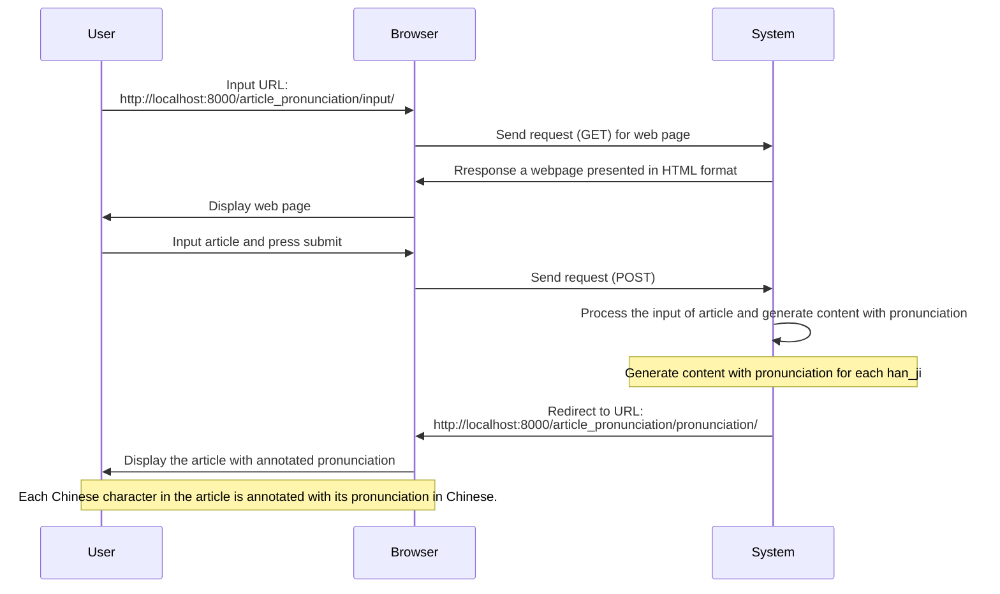
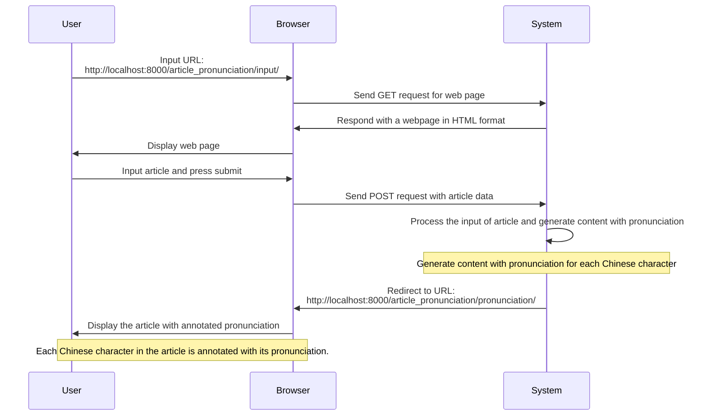

<!-- markdownlint-disable MD024 MD041 MD043 MD033 -->

# ChatGPT 諮詢問答錄

```sh
請將這個會談（Session）的「問答」輸出到一個文字檔案。文檔格式需為 markdown 標準。
```

## 問題 1

**用戶**：我需要打造一個應用系統，讓我記錄漢字的「讀音」。我的需求條列如下，請代為撰寫程式碼：
[需求列表]

**AI**：回答了用戶的問題，提供了專案設置和應用程序的實現。

## 問題 2

**用戶**：在執行「系統整合測試（System Integration Test）」及
「系統功能測試（System Functional Test）」 前，我想先做「單元測試（Unit Test）」，請提供可在
Django Project 執行 「單元測試（Unit Test）」的 Python 程式碼。

**AI**：回答了用戶的問題，提供了單元測試的程式碼範例。

## 問題 3

**用戶**：- System Functional Test: 使用 Seleiumn 及 Google Chrome 瀏覽模擬器

**AI**：回答了用戶的問題，提供了如何在系統功能測試中使用 Selenium 和 Google Chrome 的方法。

## 問題 4

**用戶**：以上程式碼改寫成「可於 Python JupyterBook 執行」之程式碼。

**AI**：回答了用戶的問題，提供了在 Jupyter Notebook 中運行功能測試的方法。

## Q5

請提供「安裝及設定的程序步驟」，說明如何建置一個「軟體功能測試環境」。

需求如下：

- Python 程式碼編輯器：使用 Python JupyterBook
- 功能測試工具：
  - 測試軟體：Selenium
  - WebDrive: ChromeDriver
  - 瀏覽器：Chrome
- Python 工具：
  - Python 版本管理工具：pyenv
  - Python Packages 安裝管理工具：poetry
  - Python Intepreter: V3.10.6
  - Django 版本：V4.1.3
- 輸出：Markdown 文字檔格式

## Q6

請彙總以上所有的問答（只要答覆即可），以 Markdown 文檔格式輸出。

## Files/Directories structure of Django Project

使用 Django 開發 Web App 系統，該 Web App 系統含有兩個子應用（Application）：

- han_ji_dict : 漢字字典，可為漢字輸入音標；
- article_prounciation : 可輸入漢字，由系統在漢字字典查找漢字的音標，然後
  再於畫面顯示已標註音標的漢字。

Django Project 的目錄結構如下：

```sh
❯ tree . -L 2
.
├── README.md
├── article_pronunciation
│   ├── __init__.py
│   ├── __pycache__
│   ├── admin.py
│   ├── apps.py
│   ├── migrations
│   ├── models.py
│   ├── templates
│   ├── tests.py
│   ├── urls.py
│   └── views.py
├── db.sqlite3
├── docs
│   ├── OP.md
│   ├── SDD.md
│   ├── SRS.md
│   ├── STS.md
│   └── URS.md
├── han_ji_dict
│   ├── __init__.py
│   ├── __pycache__
│   ├── admin.py
│   ├── apps.py
│   ├── migrations
│   ├── models.py
│   ├── tests.py
│   └── views.py
├── manage.py
├── poetry.lock
├── pyproject.toml
├── setup.cfg
├── tests
│   ├── __init__.py
│   ├── __pycache__
│   ├── fn
│   ├── it
│   └── st
├── tools
│   ├── han_ji.csv
│   ├── import_csv.py
│   ├── import_csv_drop_old_table.py
│   ├── import_csv_to_han_ji_dict.py
│   └── setenv.py
└── web_app
    ├── __init__.py
    ├── __pycache__
    ├── asgi.py
    ├── settings.py
    ├── urls.py
    └── wsgi.py
```

Web App 的網頁架構：



Web App 的流程要求如下：

1. 使用者進入此 Web App 時，以 article_prounciation Application 的根路徑
   為網站的首頁；
2. article_prounciation Application 的首頁上有「表單」，可輸入漢字，並按
   「送出」按鈕；系統將依輸入的漢字標註音標，然後顯示於畫面下方；
3. 進入 article_prounciation Application 的首頁時，上方「表單」的表單已輸
   入預設的漢字：「我可以為您標註漢字讀音」，下方則顯示已標註讀音的漢字。
4. 使用 Django Template 設計 Base View。Base View 中需使用 HTML <nav> tag
   來設計導覽列，以便使用者可依此導覽列執行系統能提供之功能。





## Q10

在 Browser 輸入： <http://localhost:8000/>

發生錯誤：

```shell
TemplateDoesNotExist at /
base.html
Request Method: GET
Request URL: http://localhost:8000/
Django Version: 4.1.7
Exception Type: TemplateDoesNotExist
Exception Value:
base.html
Exception Location: /Users/alanjui/workspace/rime/han_gi/.venv/lib/python3.10/site-packages/django/template/backends/django.py, line 84, in reraise
Raised during: article_pronunciation.views.index
Python Executable: /Users/alanjui/workspace/rime/han_gi/.venv/bin/python
Python Version: 3.10.6
Python Path:
['/Users/alanjui/workspace/rime/han_gi',
 '/Users/alanjui/.pyenv/versions/3.10.6/lib/python310.zip',
 '/Users/alanjui/.pyenv/versions/3.10.6/lib/python3.10',
 '/Users/alanjui/.pyenv/versions/3.10.6/lib/python3.10/lib-dynload',
 '/Users/alanjui/workspace/rime/han_gi/.venv/lib/python3.10/site-packages']
Server time: Wed, 22 Mar 2023 05:17:30 +0000

settings.py

Error during template rendering
In template /Users/alanjui/workspace/rime/han_gi/article_pronunciation/templates/article_pronunciation/index.html, error at line 1

base.html
1 
2
3 
4
5 
6   文章標讀音
7 
8
9 
10 
11

```

我的 Django Project 相關程式碼如下：

```python
INSTALLED_APPS = [
    'django.contrib.admin',
    'django.contrib.auth',
    'django.contrib.contenttypes',
    'django.contrib.sessions',
    'django.contrib.messages',
    'django.contrib.staticfiles',
    'han_ji_dict',
    'article_pronunciation',
]
...
TEMPLATES = [
    {
        'BACKEND': 'django.template.backends.django.DjangoTemplates',
        'DIRS': [BASE_DIR / 'templates'],
        'APP_DIRS': True,
         ...
    },
]
...
STATIC_URL = 'static/'
STATICFILES_DIRS = [BASE_DIR / 'static']
STATIC_ROOT = BASE_DIR / 'static_collected'
```

templates/base.html

```html

<!DOCTYPE html>
<html lang="en">
  <head>
    <meta charset="UTF-8" />
    <meta name="viewport" content="width=device-width, initial-scale=1.0" />
    <title>Web App</title>
    <link rel="stylesheet" href="" />
  </head>
  <body>
    <header>
      <nav>
        <ul>
          <li><a href="">首頁</a></li>
          <li><a href="">漢字字典編輯</a></li>
          <li><a href="">後台</a></li>
          <li><a href="">登出</a></li>
        </ul>
      </nav>
    </header>
    <main> </main>
    <footer>
      <p>&copy; 2023 Web App. All rights reserved.</p>
    </footer>
    <script src=""></script>
  </body>
</html>
```

static/css/site.css

```css
body {
  padding: 10px 20px;
}
```

article_pronunciation.urls.py:

```python
from django.urls import path

from . import views

urlpatterns = [
    path('', views.index, name='index'),
]
```

article_pronunciation.views.py:

```python
# article_pronunciation/views.py
from django.db.models import Max
from django.http import HttpResponseRedirect
from django.shortcuts import render
from django.urls import reverse

from han_ji_dict.models import HanJi


def index(request):
    default_text = "我可以為您標註漢字讀音"
    annotated_text = ""

    if request.method == "POST":
        input_text = request.POST.get("text", default_text)
        annotated_text = annotate_pronunciation(input_text)

    context = {
        "default_text": default_text,
        "annotated_text": annotated_text,
    }

    return render(request, "article_pronunciation/index.html", context)


def annotate_pronunciation(text):
    # annotated_text = ""
    annotated_text = []

    for character in text:
        if not character.strip():
            annotated_text.append(character)
            continue

        if character == '\n':
            annotated_text.append('<br/><br/>')
            continue

        max_freq = HanJi.objects.filter(han_ji=character).aggregate(Max('freq'))[
            'freq__max'
        ]

        if max_freq is None:
            annotated_text.append(character)
            continue

        hanji_objects = HanJi.objects.filter(han_ji=character, freq=max_freq)
        annotated_text.extend(hanji_objects)

    return annotated_text
```

article_pronunciation/templates/article_pronunciation/index.html

```djangohtml




 文章標讀音 





  <form method="post">
    
    <label for="text">請輸入漢字：</label>
    <textarea name="text" id="text" rows="4" cols="50">
  {{ default_text }}</textarea
    >
    <br />
    <button type="submit">送出</button>
  </form>
  <br />
  
  <h2>已標註讀音的漢字：</h2>
  <div class="pronunciation">
     
    <ruby> {{ char.han_ji }}<rt>{{ char.chu_im }}</rt> </ruby>
     {{ char|safe }}  
  </div>
  

```
